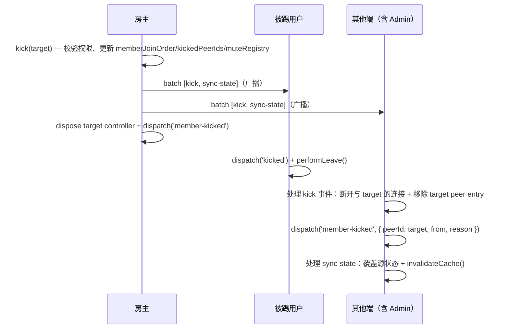
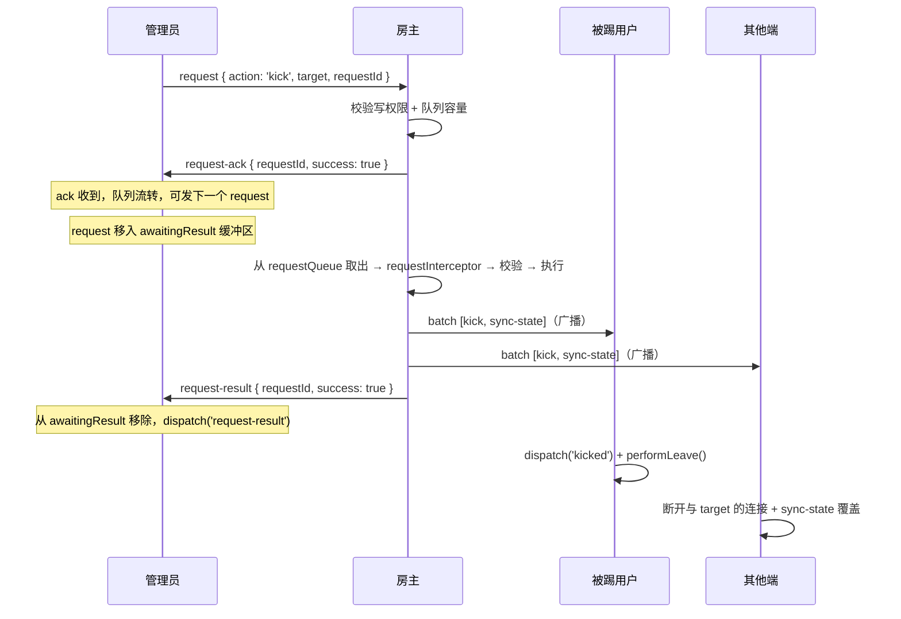

# RFC: rtcRoom 权限控制 — Kick 流程

> scope: `src/shared/rtc-room/permissions`
>
> parent: [RFC.md](./RFC.md)（版本与状态由主文档统一管理）
>
> 依赖: [RFC-request-queue.md](./RFC-request-queue.md)（管理员 request 队列处理流程）

## 概述

本文档描述 kick（踢人）的完整流程，包括房主直接 kick、管理员 request kick（两阶段：ack + result）、kick 缓存防重连机制。

## kick 流程

```text
房主/管理员调用 kick(targetPeerId, reason):
  0. assertPermissionsEnabled(ctx)
  0.1. 前置校验：若 targetPeerId === '*' → 报错（kick 不接受 '*'，仅 mute/unmute 可操作房间层）
  1. 断言 ctx.ctrlChannelWritable === true（无写权限则报错）
  2. 房主免疫：target === hostId → 报错（房主不可被踢）
  3. 管理员互踢防护：target 在 adminIds 中 且 localPeerId !== hostId → 报错
  4. 若 localPeerId === hostId（房主直接执行）:
     a. 从 ctx.memberJoinOrder 中移除 targetPeerId
     b. ctx.kickedPeerIds.push(targetPeerId)
        // 注意：必须在广播之前更新缓存，防止 target 在广播送达前断线重连绕过检测
        // 重连校验只在房主端执行，其他端的 kickedPeerIds 副本仅用于本地状态一致性，不参与重连拦截决策
     b2. delete ctx.muteRegistry.users[targetPeerId]（清理被踢用户的禁言条目，减少 sync-state 体积）
     c. 广播给所有已连接 peer（含 target）:
        { type: 'batch', events: [{ type: 'kick', target, from: localPeerId, reason }, { type: 'sync-state', ...payload }] }
        // 注：target 能收到完整 batch 依赖 DataChannel reliable + ordered 模式的有序送达保证——
        // close() 前 buffer 中的消息会被 flush 送达对端，target 在连接关闭前能处理完整 batch。
     d. dispose target 对应 peer 的 controller + 从 peers 移除
     e. dispatch('member-kicked', { peerId: target, from: localPeerId, reason })
  5. 若 localPeerId !== hostId（管理员向房主发送请求）:
     将 request 加入本地串行队列（前一个 request 的 ack 返回或超时后即可发送下一个）
     通过 __room_ctrl__ channel 发送给房主: { type: 'request', requestId, action: 'kick', target, reason }
     等待 ack 响应（超时时间 = parameters.requestTimeout ?? 5000ms，超时则 dispatch('request-timeout', { requestId, action }) + throwError）
     收到 ack 后队列流转（允许发送下一个 request）。最终执行结果通过 result 报文异步通知

房主收到 request(action=kick) 消息:
  注意：from 从 PeerEntry.peerId 获取（建连时确定的对端身份），是唯一可信的发送者标识。
  完整 request 处理流程（ack + result 两阶段、队列管理、拦截器等）见 [RFC-request-queue.md](./RFC-request-queue.md)，此处仅列出 kick 特有的校验和执行逻辑：
  1. 写权限校验 + 队列容量校验 → 回复 ack（通用流程）
  2. 从队列取出处理时：
     a. requestInterceptor 外部卡点（通用流程）
     b. kick 特有校验：不可踢房主、管理员不可踢管理员等
     c. 校验通过 → 执行 kick 操作:
        - 从 ctx.memberJoinOrder 中移除 targetPeerId
        - ctx.kickedPeerIds.push(targetPeerId)
        - delete ctx.muteRegistry.users[targetPeerId]（清理被踢用户的禁言条目）
        - 广播给所有已连接 peer（含 target）: { type: 'batch', events: [{ type: 'kick', target, from, reason }, { type: 'sync-state', ...payload }] }
        - dispose target 的 controller + 从 peers 移除
        - 单播 result 给发起管理员:
          { type: 'request-result', requestId, action: 'kick', target, success: true }
        - dispatch('member-kicked', { peerId: target, from, reason })

target 收到 batch 中的 kick 事件（target === localPeerId）:
  1. dispatch('kicked', { from, reason }) + performLeave()
  注意：performLeave() 仅断开所有 P2P 连接并清理本地状态，不通过任何 channel 发送消息，因此无需禁言检测。
  若 target 是管理员，performLeave 内部会销毁其 request 队列和待完结缓冲区（awaitingResult），
  与被 removeAdmin 时的清理行为一致——确保管理员被 kick 后不会残留未完结的请求。

其他端收到 batch 消息:
  按序处理 events 数组中的每个事件（kick → sync-state）

收到 kick 事件（非 target）:
  主动断开与 target 的连接 + 移除 target peer entry + dispatch('member-kicked', { peerId, from, reason })
  （源状态如 memberJoinOrder 由后续 sync-state 统一覆盖，无需手动操作）

管理员收到 request-result 消息:
  1. 根据 requestId 匹配本地已发送的 request（若匹配不到则忽略）
  2. 若 success === true → dispatch('request-result', { success: true, requestId, action, target, scope })
  3. 若 success === false → dispatch('request-result', { success: false, requestId, action, target, scope, error })
```

## kick 缓存防重连

- kick 成功后，被踢用户的 peerId 加入 `kickedPeerIds` 缓存（房间生命周期内有效）
- 新 peer 连接 / 断线重连时，房主端校验 peerId 是否在 `kickedPeerIds` 中，命中则拒绝连接（dispose）
- `kickedPeerIds` 通过 sync-state 同步给所有端，所有端均持有缓存副本
- **非房主端仅作为状态备份**，在升级为房主后（选举继位或 transferHost）自动生效，无需额外同步
- 房间关闭销毁后缓存随之清除——后续以相同 roomId 加入视为全新房间，被踢用户可正常加入（视为新用户）

## 时序图

### 房主直接 kick



### 管理员 request kick（两阶段：ack + result）



## 设计决策

> 通用 kick 决策（房主免疫、管理员互踢防护、kick 缓存生命周期等）见 [RFC-core.md](./RFC-core.md) 设计决策表。以下仅列出**kick 流程特有的决策**。

| 决策点 | 选择 | 理由 |
|--------|------|------|
| kick 广播含 target | 广播给所有已连接 peer（含 target），而非先单播 target 再广播其他端 | 简化实现——单次广播即可，无需维护两步发送逻辑。DataChannel reliable + ordered 模式保证 close() 前 buffer 中的消息会被 flush 送达对端，target 在连接关闭前能处理完整 batch（dispatch 'kicked' + performLeave）。早期版本（v0.13.0-v0.16.0）尝试过先单播再广播 / kick-ack 确认送达等方案，均增加了复杂度但未带来实质收益 |
| kickedPeerIds 更新时机 | 广播之前更新（步骤 b 在步骤 c 之前） | 防止 target 在广播送达前因网络波动断线重连，重连校验依赖 kickedPeerIds 缓存。若先广播再更新，存在时间窗口导致重连绕过检测 |
| kick 后清理 muteRegistry | 从 `users[targetPeerId]` 中删除被踢用户的禁言条目 | 减少 sync-state 体积——被踢用户不在房间内，其禁言条目语义无效。若后续以相同 peerId 重新加入（新房间），视为全新用户，无历史禁言 |
