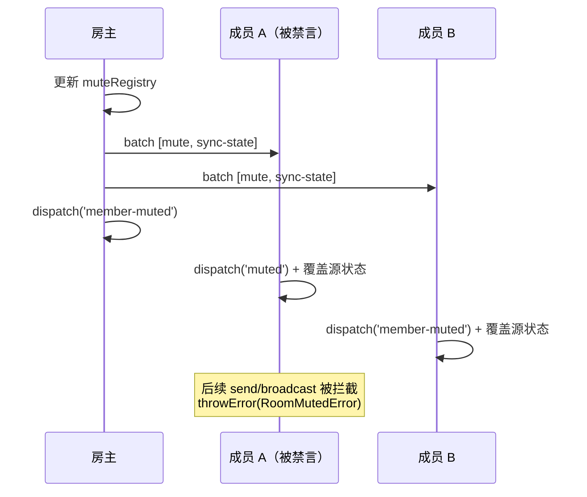
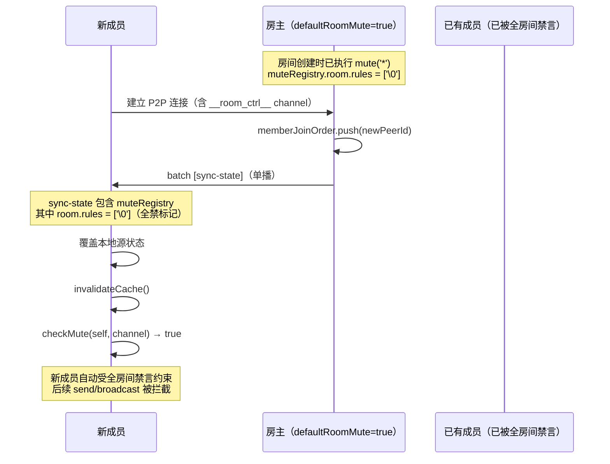

# RFC: rtcRoom 权限控制 — 禁言系统

> scope: `src/shared/rtc-room/permissions/mute`
>
> parent: [RFC.md](./RFC.md)（版本与状态由主文档统一管理）
>
> 依赖: [RFC-request-queue.md](./RFC-request-queue.md)（管理员 request 队列处理流程）

## 概述

本文档描述禁言系统的完整流程，包括三层禁言粒度、mute/unmute 操作流程、checkMute 匹配逻辑、getMuteState 查询、发送拦截机制，以及全房间禁言与绕过策略的交互。

> 历史背景参考：禁言数据结构（组合键两层策略）的重构过程记录在 [archive/RFC-mute-refactor.md](./archive/RFC-mute-refactor.md)（已合入本文档）
>
> 历史背景参考：禁言策略的原始抽离过程记录在 [archive/RFC-mute-strategy.md](./archive/RFC-mute-strategy.md)（已被组合键方案替代）

## 三层禁言粒度

**粒度覆盖关系**：粗粒度规则自动覆盖其下所有细粒度——全禁覆盖所有 channel 所有 event；channel 级禁言覆盖该 channel 下所有 event（含原始数据）。这由组合键的 `startsWith` 前缀匹配天然保证：`'chat\0'` 是 `'chat\0message'` 的前缀，因此 channel 被禁时该 channel 的所有 event 均被拦截，无需逐个添加 event 级规则。

```typescript
/**
 * 禁言范围
 * - 不传 scope：用户级全禁（所有 channel 所有事件）
 * - 传 { channel }：channel 级（该 channel 的自定义事件 + 原始数据均禁）
 * - 传 { channel, event }：事件级（仅禁该 channel 的特定自定义事件）
 */
interface MuteScope {
  /** 目标 channel label。省略表示所有 channel */
  readonly channel?: string;
  /** 目标自定义事件名。省略表示 channel 下所有事件（含原始数据） */
  readonly event?: string;
}
```

## 禁言数据结构（组合键两层策略）

```typescript
/**
 * 组合键分隔符（NULL 字符）
 * - 用户不可能在 channel/event 名中使用 \0
 * - JSON 合法（序列化为 \u0000），无歧义
 * - 无冲突，无需约束业务侧 channel/event 命名
 */
const MUTE_SEP = '\0';

/**
 * 构建匹配目标字符串
 * - buildTarget()             → '\0'        — 全禁标记（匹配一切）
 * - buildTarget('chat')       → 'chat\0'    — channel 级
 * - buildTarget('chat', 'msg') → 'chat\0msg' — event 级
 */
function buildTarget(channel?: string, event?: string): string {
  // 注意：channel 和 event 仅判断 falsy（!channel / !event），
  // 空字符串 '' 视为未传（与 undefined 行为一致，均返回更粗粒度的结果）。
  // 业务侧不应传入空字符串作为 channel/event 名——DataChannel label 和自定义事件名
  // 本身就不允许空字符串（空 label 的 DataChannel 无法正常工作），因此此处无需额外校验。
  if (!channel) return MUTE_SEP;
  if (!event) return channel + MUTE_SEP;
  return channel + MUTE_SEP + event;
}

/**
 * 解析组合键规则为结构化信息
 */
function parseRule(rule: string): ParsedRule {
  if (rule === MUTE_SEP) return { };
  const sepIndex = rule.indexOf(MUTE_SEP);
  if (sepIndex === -1) return { };
  const channel = rule.slice(0, sepIndex);
  const event = rule.slice(sepIndex + 1);
  if (!event) return { channel };
  return { channel, event };
}

/**
 * 组合键解析结果
 */
interface ParsedRule {
  /** 解析后的 channel（全禁时为 undefined） */
  readonly channel?: string;
  /** 解析后的 event（channel 级时为 undefined） */
  readonly event?: string;
}

/**
 * 禁言状态查询结果
 */
interface MuteState {
  /** 是否被禁言（将所有规则按优先级合并后，存在至少一个最终生效的禁言规则即为 true） */
  readonly muted: boolean;
  /** room 层对该用户生效的禁言规则（已过滤 __room_ctrl__、已排除被豁免的） */
  readonly roomRules: ParsedRule[];
  /** room 层的豁免规则 */
  readonly roomExemptions: ParsedRule[];
  /** user 层对该用户生效的禁言规则（已过滤 __room_ctrl__、已排除被豁免的） */
  readonly userRules: ParsedRule[];
  /** user 层的豁免规则 */
  readonly userExemptions: ParsedRule[];
}

/**
 * 禁言规则集（单层）
 * rules 和 exemptions 均为组合键字符串数组，通过 startsWith 前缀匹配判断
 */
interface MuteRuleSet {
  /** 禁言规则列表 */
  rules: string[];
  /** 豁免规则列表（由 unmute 子集匹配产生，仅对比 rules 更细粒度的范围生效） */
  exemptions: string[];
}

/**
 * 禁言注册表（两层结构）
 * - room：全房间禁言策略（对所有人生效，host 免疫，admin 是否免疫由开关决定）
 * - users：用户级禁言策略（key = peerId）
 *
 * 用户层优先级高于房间层——用户层有明确结论（禁言或豁免）时直接返回，不再查询房间层
 */
interface MuteRegistry {
  /** 全房间禁言策略 */
  room: MuteRuleSet;
  /** 用户级禁言策略（key = peerId） */
  users: Record<string, MuteRuleSet>;
}
```

**规则格式总结**：

| 粒度 | 组合键格式 | 示例 | startsWith 匹配范围 |
|------|-----------|------|---------------------|
| 全禁 | `\0` | `'\0'` | 匹配一切（所有 channel 所有 event） |
| channel 级 | `channel\0` | `'chat\0'` | 匹配该 channel 的所有 event |
| event 级 | `channel\0event` | `'chat\0message'` | 仅匹配该 channel 的该 event |

## 辅助函数

```text
/**
 * 确保用户级规则集存在（不存在则创建空规则集并挂载）
 * 用于 mute 操作时按需初始化用户级 MuteRuleSet
 */
ensureUserRuleSet(users: Record<string, MuteRuleSet>, peerId: string): MuteRuleSet
  if (!users[peerId]):
    users[peerId] = { rules: [], exemptions: [] }
  return users[peerId]
```

## applyMute（禁言规则写入）

```text
/**
 * 将禁言规则写入规则集
 *
 * 两种模式：
 * - 全禁（ruleKey === '\0'）：追加全禁标记 + 清空豁免，但**保留已有的细粒度 rules**。
 *   全禁是一个"开关"——打开全禁不会丢失已有规则，后续解除全禁（unmute 删除 '\0'）后
 *   原有细粒度规则继续生效。清空 exemptions 的理由：全禁覆盖一切，
 *   已有的豁免条目在全禁语义下无意义（全禁本身是最粗粒度，不存在比它更粗的规则需要豁免）。
 * - 非全禁（channel 级 / event 级）：追加去重——将 ruleKey 加入 rules（幂等），
 *   同时移除 exemptions 中被该 ruleKey 覆盖的条目（startsWith 过滤），
 *   防止残留的豁免条目抵消新增的禁言规则。
 */
applyMute(ruleSet: MuteRuleSet, ruleKey: string):
  if (ruleKey === MUTE_SEP):
    // 全禁：追加全禁标记（幂等）+ 清空豁免，保留已有细粒度 rules
    if (!ruleSet.rules.includes(MUTE_SEP)):
      ruleSet.rules.push(MUTE_SEP)
    ruleSet.exemptions = []
    return

  // 非全禁：追加去重
  if (!ruleSet.rules.includes(ruleKey)):
    ruleSet.rules.push(ruleKey)

  // 移除被新规则覆盖的豁免条目——
  // 例：exemptions 中有 'chat\0msg'，新增 rules 'chat\0'（channel 级），
  // 则 'chat\0msg'.startsWith('chat\0') = true，该豁免被新禁言覆盖，应移除。
  ruleSet.exemptions = ruleSet.exemptions.filter(e => !e.startsWith(ruleKey))
```

## mute 流程

```text
async function mute(target, scope?):
  0. assertPermissionsEnabled(ctx)
  1. 断言 ctx.ctrlChannelWritable === true（无写权限则报错）
  2. 目标确定:
     - target === '*' → 操作房间层（room）
     - 其他值 → 操作用户层（users[target]）
  3. 权限层级校验（host → admin → user 单向管理链）：
     - target !== '*' 且 target === hostId → 报错（房主不可被禁言）
     - target !== '*' 且 adminIds.includes(target) 且 localPeerId !== hostId → 报错（管理员不可禁言其他管理员，仅房主可操作管理员）
  4. __room_ctrl__ channel 禁言权限校验：
     - scope.channel === '__room_ctrl__' 且 localPeerId !== hostId → 报错（仅房主可禁言管理 channel）
  5. 若 localPeerId === hostId（房主直接执行）:
     a. 更新本地 muteRegistry:
        ruleKey = buildTarget(scope?.channel, scope?.event)
        若 target === '*'（操作房间层）:
          applyMute(ctx.muteRegistry.room, ruleKey)
        若 target !== '*'（操作用户层）:
          userRuleSet = ensureUserRuleSet(ctx.muteRegistry.users, target)
          applyMute(userRuleSet, ruleKey)
     b. 合并广播: { type: 'batch', events: [{ type: 'mute', target, from: localPeerId, scope }, { type: 'sync-state', ...payload }] }
     c. dispatch('member-muted', { peerId: target, scope, from: localPeerId })
     d. return（房主端同步完成，无 await 点，Promise 立即 resolve）
  6. 若 localPeerId !== hostId（管理员向房主发送请求）:
     将 request 加入本地串行队列（前一个 request 的 ack 返回或超时后即可发送下一个）
     通过 __room_ctrl__ channel 发送给房主: { type: 'request', requestId, action: 'mute', target, scope }
     await 等待 ack 响应（超时时间 = parameters.requestTimeout ?? 5000ms，超时则 dispatch('request-timeout', { requestId, action }) + throwError）
     收到 ack 后队列流转（允许发送下一个 request）。最终执行结果通过 result 报文异步通知

房主收到 request(action=mute) 消息:
  注意：from 从 PeerEntry.peerId 获取（建连时确定的对端身份）
  1. 校验 from 的 ctrlChannelWritable（断言写权限）
  2. 若写权限校验失败 → 回复 ack: { type: 'request-ack', requestId, success: false, error: '无写权限' }
  3. 断言队列未满: requestQueue.size >= maxPendingRequests → 回复 ack: { type: 'request-ack', requestId, success: false, error: 'queue full' }
  4. 写权限校验通过且队列未满 → 回复 ack: { type: 'request-ack', requestId, success: true }（表示已接受）
  5. 将 request（附带 from）加入房主端 requestQueue
  6. 从队列取出处理时：
     a. 调用 requestInterceptor（外部卡点，默认通过）
     b. 若卡点拒绝 → 单播 result 给发起管理员:
        { type: 'request-result', requestId, action: 'mute', target, scope, success: false, error: '拦截器拒绝: ...' }
     c. 校验目标合法性（不可禁言房主、管理员不可禁言管理员、__room_ctrl__ 禁言仅房主可操作等）
     d. 若校验失败 → 单播 result 给发起管理员:
        { type: 'request-result', requestId, action: 'mute', target, scope, success: false, error: '校验失败: ...' }
     e. 校验通过 → 执行 mute 操作:
        - 更新本地 muteRegistry（同步骤 5a）
        - 合并广播给所有端: { type: 'batch', events: [{ type: 'mute', target, from, scope }, { type: 'sync-state', ...payload }] }
        - 单播 result 给发起管理员:
          { type: 'request-result', requestId, action: 'mute', target, scope, success: true }
        - dispatch('member-muted', { peerId: target, scope, from })

非房主端收到 mute 事件（通过 batch）:
  1. 仅 dispatch 事件，不操作 muteRegistry 等源状态（由后续 sync-state 统一覆盖）
  2. 被禁言方（target === localPeerId 或 target === '*' 且受影响）:
     dispatch('muted', { scope, from })
  3. 其他方 dispatch('member-muted', { peerId, scope, from })

发送拦截（本地被禁言时）:
  broadcast/send/broadcastTo/sendTo/sendRaw/broadcastRaw 在发送前:
    isMuted = checkMute(ctx, localPeerId, channelLabel, eventName)
    if (isMuted):
      throwError('send', 'muted: ...', RoomMutedError)

注意：channel 禁言仅影响写权限（发送拦截），消息接收不受影响。
被禁言用户仍能正常接收该 channel 的消息。
```

## unmute 流程

```text
async function unmute(target, scope?):
  0. assertPermissionsEnabled(ctx)
  1. 断言 ctx.ctrlChannelWritable === true（无写权限则报错）
  2. 权限层级校验（host → admin → user 单向管理链）：
     - target !== '*' 且 target === hostId → 报错（房主不可被解禁——房主本身免疫禁言，解禁无意义，明确拒绝避免产生无效广播）
     - target === localPeerId 且 localPeerId !== hostId → 报错（admin 不可自解禁）
       // 注：普通用户不会触达此分支——步骤 1 的 ctrlChannelWritable 断言要求调用方具备
       // __room_ctrl__ 写权限，而普通用户无写权限，在步骤 1 即被拦截。
       // 因此实际能到达此校验的只有管理员（和房主，但房主 localPeerId === hostId 不命中条件）。
       // 条件表述为通用形式（不显式判断 isAdmin）以保持防御性——若未来引入新角色仍有效。
     - adminIds.includes(target) 且 localPeerId !== hostId → 报错（管理员不可解禁其他管理员，仅房主可操作管理员）
  3. __room_ctrl__ channel 解禁权限校验：
     - scope.channel === '__room_ctrl__' 且 localPeerId !== hostId → 报错（仅房主可操作管理 channel 的禁言）
  4. 目标确定:
     - target === '*' → 操作房间层（room）
     - 其他值 → 操作用户层（users[target]）
  5. 若 localPeerId === hostId（房主直接执行）:
     a. 更新 muteRegistry:
        ruleKey = buildTarget(scope?.channel, scope?.event)

        /**
         * unmute 核心逻辑（applyUnmute）——房间层和用户层复用同一算法：
         *
         * 前提：unmute 的 ruleKey 必须被已有禁言规则覆盖（是其子集或相等）才会生效，否则忽略。
         * 判断方式：先精确匹配（`rule === ruleKey`），再通过 `findNarrowestCover` 查找覆盖 ruleKey 的最细粒度规则
         * （即 ruleKey 被某条 rule 的前缀覆盖，或被全禁标记覆盖）。
         * 注：全禁标记需显式判断 `rule === MUTE_SEP`，因为 JS 中 `'chat\0'.startsWith('\0')` === false。
         *
         * 匹配后按关系分两种处理：
         * - 相等（ruleKey === matchedRule）→ 直接从 rules 中删除该规则（真正解禁），
         *   并清除 exemptions 中属于该规则子集的所有豁免条目（规则已删除，子集豁免不再有意义）
         * - 子集（ruleKey 比 matchedRule 更细粒度）→ 将 ruleKey 加入 exemptions（豁免，幂等去重）
         * - 不匹配（无任何 rule 覆盖 ruleKey）→ 无操作，静默忽略
         *
         * 示例：
         * - rules=['a\0'], exemptions=[], unmute ruleKey='a\0b'
         *   → 'a\0b'.startsWith('a\0')=true, 不相等 → 加入 exemptions
         *   → rules=['a\0'], exemptions=['a\0b']
         *
         * - rules=['a\0'], exemptions=['a\0b'], unmute ruleKey='a\0'
         *   → 相等 → 删除 'a\0'，同时清除 exemptions 中以 'a\0' 为前缀的条目（'a\0b'）
         *   → rules=[], exemptions=[]
         *
         * - rules=['a\0'], unmute ruleKey='\0'   → rule='a\0'，'\0'.startsWith('a\0')=false 且 'a\0' !== MUTE_SEP → 忽略（unmute 范围比禁言更粗，不是子集）
         * - rules=['a\0'], unmute ruleKey='b\0'  → 'b\0'.startsWith('a\0')=false → 忽略（无覆盖关系）
         */
        applyUnmute(ruleSet, ruleKey):
          // **优先精确匹配**：先查找与 ruleKey 完全相同的规则（直接删除），
          // 仅在无精确匹配时才走 findNarrowestCover 查找最细粒度的覆盖规则（加入豁免）。
          // 原因：当 rules 同时包含全禁标记和细粒度规则时（如 ['\0', 'chat\0']），
          // unmute ruleKey='chat\0' 应精确删除 'chat\0'（真正解禁），
          // 而非因先命中全禁标记而误入子集分支（变成豁免）。
          // findNarrowestCover 与 findHighestGranularityMatch 类似，但方向相反——
          // 前者找"覆盖 ruleKey 的最细粒度规则"，后者找"被 target 命中的最细粒度规则"。
          matchedRule = ruleSet.rules.find(rule => rule === ruleKey)
            ?? findNarrowestCover(ruleSet.rules, ruleKey)
          if (!matchedRule): return  // 未被任何禁言规则覆盖，忽略
          if (ruleKey === matchedRule):
            // 精确匹配 → 直接删除该规则（真正解禁）
            ruleSet.rules = ruleSet.rules.filter(r => r !== ruleKey)
            // 同时清除 exemptions 中属于该规则子集的所有豁免条目——
            // 规则已删除，其下的豁免不再有意义，保留只会造成冗余。
            // 注意：全禁标记 '\0' 需要特殊处理——JS 中 'chat\0msg'.startsWith('\0') === false
            // （'\0' 是 U+0000，普通字符串以实际字符开头，不以 '\0' 开头），
            // 因此 startsWith 无法匹配非 '\0' 的子级条目。
            // 解决方案：删除全禁标记时直接清空 exemptions。
            // 与 applyMute 全禁时清空 exemptions 对称——
            // applyMute 清空的理由：全禁覆盖一切，已有豁免在全禁语义下无意义；
            // applyUnmute 清空的理由：全禁规则被删除后，其下所有豁免失去语义（无规则可豁免）。
            // 两者清空 exemptions 的时机不同（前者是规则生效时，后者是规则删除时），但目的一致：保持 exemptions 与 rules 的语义一致性。
            if (ruleKey === MUTE_SEP):
              ruleSet.exemptions = []
            else:
              ruleSet.exemptions = ruleSet.exemptions.filter(e => !e.startsWith(ruleKey))
          else:
            // 子集 → 加入豁免列表（幂等去重）
            // 注：不做冗余检测——若 exemptions 中已有更粗粒度的豁免覆盖 ruleKey（如已有 'chat\0'，
            // 再加入 'chat\0msg'），两条豁免都会保留。这不影响正确性（findHighestGranularityMatch
            // 会正确找到最细粒度匹配），但可能导致 exemptions 数组随频繁操作逐步增长。
            // 后续版本可考虑引入冗余合并（移除被更粗粒度豁免覆盖的细粒度条目），见后续版本规划。
            if (!ruleSet.exemptions.includes(ruleKey)):
              ruleSet.exemptions.push(ruleKey)

        若 target === '*'（操作房间层）:
          - scope 未传 → applyUnmute(ctx.muteRegistry.room, buildTarget())
            // 即 ruleKey = '\0'，精确匹配删除全禁标记，保留其他细粒度 rules。
            // 与 mute('*') 不传 scope 的"追加全禁标记"语义对称——
            // mute('*') 打开全禁开关，unmute('*') 关闭全禁开关，已有细粒度规则不受影响。
          - 传 scope → applyUnmute(ctx.muteRegistry.room, ruleKey)
        若 target !== '*'（操作用户层）:
          userRuleSet = ctx.muteRegistry.users[target]
          若 userRuleSet 不存在 → 静默返回（无操作、不广播、不 dispatch）
            // 注：目标用户无规则集意味着从未被禁言过，unmute 无实际效果。
            // 跳过广播避免无意义的 batch 消息开销。
            // 管理员通过 request 路径时，房主端同样检测到无规则集，直接回复 result(success=true)，
            // 不执行广播——幂等语义下 unmute 一个未被禁言的用户等价于成功，无需通知其他端。
          - scope 未传 → applyUnmute(userRuleSet, buildTarget())
            // 即 ruleKey = '\0'，精确匹配删除用户级全禁标记，保留其他细粒度 rules。
            // 若要彻底清空该用户所有规则，需逐条 unmute 或直接操作 muteRegistry（内部方法）。
          - 传 scope → applyUnmute(userRuleSet, ruleKey)
          - 若规则集为空（rules.length === 0 && exemptions.length === 0）→ delete ctx.muteRegistry.users[target]（清理空条目）
     b. 合并广播: { type: 'batch', events: [{ type: 'unmute', target, from: localPeerId, scope }, { type: 'sync-state', ...payload }] }
     c. dispatch('member-unmuted', { peerId: target, scope, from: localPeerId })
     d. return（房主端同步完成，无 await 点，Promise 立即 resolve）
  6. 若 localPeerId !== hostId（管理员向房主发送请求）:
     将 request 加入本地串行队列（前一个 request 的 ack 返回或超时后即可发送下一个）
     通过 __room_ctrl__ channel 发送给房主: { type: 'request', requestId, action: 'unmute', target, scope }
     await 等待 ack 响应（超时时间 = parameters.requestTimeout ?? 5000ms，超时则 dispatch('request-timeout', { requestId, action }) + throwError）
     收到 ack 后队列流转（允许发送下一个 request）。最终执行结果通过 result 报文异步通知

房主收到 request(action=unmute) 消息:
  注意：from 从 PeerEntry.peerId 获取（建连时确定的对端身份）
  1. 校验 from 的 ctrlChannelWritable（断言写权限）
  2. 若写权限校验失败 → 回复 ack: { type: 'request-ack', requestId, success: false, error: '无写权限' }
  3. 断言队列未满: requestQueue.size >= maxPendingRequests → 回复 ack: { type: 'request-ack', requestId, success: false, error: 'queue full' }
  4. 写权限校验通过且队列未满 → 回复 ack: { type: 'request-ack', requestId, success: true }（表示已接受）
  5. 将 request（附带 from）加入房主端 requestQueue
  6. 从队列取出处理时：
     a. 调用 requestInterceptor（外部卡点，默认通过）
     b. 若卡点拒绝 → 单播 result 给发起管理员:
        { type: 'request-result', requestId, action: 'unmute', target, scope, success: false, error: '拦截器拒绝: ...' }
     c. 校验合法性（自解禁防护、管理员不可解禁管理员、__room_ctrl__ 解禁仅房主可操作等）
     d. 若校验失败 → 单播 result 给发起管理员:
        { type: 'request-result', requestId, action: 'unmute', target, scope, success: false, error: '校验失败: ...' }
     e. 校验通过 → 执行 unmute 操作:
        - 若 target !== '*' 且 ctx.muteRegistry.users[target] 不存在 →
          直接回复 result(success=true)，不广播、不 dispatch（与房主直接执行路径一致）
        - 更新 muteRegistry（同步骤 5a）
        - 合并广播给所有端: { type: 'batch', events: [{ type: 'unmute', target, from, scope }, { type: 'sync-state', ...payload }] }
        - 单播 result 给发起管理员:
          { type: 'request-result', requestId, action: 'unmute', target, scope, success: true }
        - dispatch('member-unmuted', { peerId: target, scope, from })
```

## checkMute 禁言匹配逻辑

```text
/**
 * 禁言检查
 * @param ctx - 房间上下文
 * @param peerId - 目标用户
 * @param channel - channel 名称。传入特殊标记 EXCLUDE_CTRL 时表示"检查所有非 __room_ctrl__ 规则"
 * @param event - 事件名称
 *
 * 当 channel === EXCLUDE_CTRL 时：
 *   过滤掉 __room_ctrl__ 相关规则后，判断剩余规则集中是否存在至少一条禁言规则。
 *   此模式用于 getMuteState.muted 计算——判断用户在业务层面是否被禁言（排除管理 channel）。
 *   与普通 checkMute 不同，EXCLUDE_CTRL 不针对某个特定 target 做前缀匹配，
 *   而是通过 hasEffectiveRule 判断过滤后的 rules 是否非空（rules 非空即有效——
 *   因 applyUnmute 保证精确匹配的 unmute 会直接删除 rule，exemptions 中只存在子集豁免）。
 */
const EXCLUDE_CTRL = Symbol('EXCLUDE_CTRL')

/**
 * 判断一条规则是否属于 __room_ctrl__ channel
 * 匹配条件：规则以 '__room_ctrl__\0' 为前缀（即 channel 级或 event 级的 __room_ctrl__ 规则）
 */
function isCtrlChannelRule(rule: string): boolean {
  return rule.startsWith('__room_ctrl__' + MUTE_SEP)
}

checkMute(ctx, peerId, channel?: string | typeof EXCLUDE_CTRL, event?: string):
  // host 永远免疫
  // 空窗期行为（ctx.hostId === ''）：不存在免疫者，所有已有 mute 规则正常生效。
  // 这是预期行为——空窗期无房主，不存在需要免疫的角色。prevHost 已离开（触发选举的前提），
  // 其在 muteRegistry 中的条目会在 performElected 中被清理，不影响选举后状态一致性。
  if (peerId === ctx.hostId) return false

  // EXCLUDE_CTRL 模式：判断过滤后的规则集中是否存在至少一条禁言规则。
  // 过滤掉 isCtrlChannelRule 的条目后再评估。这意味着仅豁免 __room_ctrl__ 的条目也会被移除，
  // 不会影响全禁判定——这是 by design 的：EXCLUDE_CTRL 的语义是"假设 __room_ctrl__ 不存在时的禁言状态"，
  // 豁免 __room_ctrl__ 不应改变用户在业务层面的禁言结论。
  //
  // 与普通 checkMute 的区别：普通模式是"给定 target，判断是否被禁言"（前缀匹配）；
  // EXCLUDE_CTRL 模式是"是否存在任何禁言规则"（hasEffectiveRule 判断 rules 是否非空）。
  if (channel === EXCLUDE_CTRL):
    userRuleSet = ctx.muteRegistry.users[peerId]
    if (userRuleSet):
      filteredUserRuleSet = {
        rules: userRuleSet.rules.filter(r => !isCtrlChannelRule(r)),
        exemptions: userRuleSet.exemptions.filter(r => !isCtrlChannelRule(r))
      }
      userResult = hasEffectiveRule(filteredUserRuleSet)
      // 仅 'muted' 时短路返回 true；'exempt'（孤立豁免，无对应 rules）和 'no_match' 均穿透到房间层。
      // 理由：EXCLUDE_CTRL 模式用于 getMuteState.muted 判断"业务层面是否被禁言"。
      // 用户层的孤立 exemptions（rules 为空、exemptions 非空）不应阻断房间层全禁的判定——
      // 它们是 applyUnmute 级联清除不彻底时的残留，不代表用户被显式豁免。
      if (userResult === 'muted'):
        return true
    // 房间层
    // 注：管理员（roomMuteAffectsAdmin=false）走 return false 分支时，表示管理员免疫房间层禁言。
    // 即使用户层返回 'exempt'（孤立豁免穿透），最终 muted=false 也是预期行为——
    // 管理员在业务层面未被禁言（用户层无有效 rules + 房间层免疫），getMuteState.muted=false 正确。
    // 语义过渡说明：用户层 hasEffectiveRule 返回 'exempt' 意味着"有孤立豁免但无有效禁言规则"，
    // 穿透到房间层后，管理员免疫条件命中时直接 return false（未被禁言），
    // 即 'exempt' → false 表示"豁免残留不构成禁言结论"，最终 getMuteState.muted=false。
    if (ctx.switches.roomMuteAffectsAdmin || !ctx.adminIds.includes(peerId)):
      filteredRoomRuleSet = {
        rules: ctx.muteRegistry.room.rules.filter(r => !isCtrlChannelRule(r)),
        exemptions: ctx.muteRegistry.room.exemptions.filter(r => !isCtrlChannelRule(r))
      }
      return hasEffectiveRule(filteredRoomRuleSet) === 'muted'
    return false

  // __room_ctrl__ 特殊处理：仅用户级具名匹配，跳过 room 层。
  // 设计意图：全房间禁言（mute('*')）不影响 __room_ctrl__ channel——
  // 该 channel 的禁言/解禁只能通过指名操作（mute(peerId, { channel: '__room_ctrl__' })）且仅房主可执行。
  // 这保证了管理员在全房间禁言时仍能执行管理操作（kick/mute/unmute 需要 __room_ctrl__ 写权限）。
  //
  // 与 roomMuteAffectsAdmin 的关系：即使 roomMuteAffectsAdmin === true，__room_ctrl__ 仍跳过房间层。
  // 这是 by design 的——roomMuteAffectsAdmin 控制的是管理员在**业务 channel** 上的禁言行为，
  // 而 __room_ctrl__ 是权限系统内部的管理通道，其写权限必须通过指名操作显式控制（仅房主可操作），
  // 不应被房间级全禁规则意外影响。否则 roomMuteAffectsAdmin=true 时管理员连 kick/mute 操作都无法执行，
  // 与"管理员维持房间秩序"的角色定位矛盾。
  if (channel === '__room_ctrl__'):
    userRuleSet = ctx.muteRegistry.users[peerId]
    if (!userRuleSet) return false
    target = buildTarget('__room_ctrl__', event)
    return matchRuleSet(userRuleSet, target)

  target = buildTarget(channel, event)

  // 第一优先级：用户层（细粒度高 → 优先级高）
  userRuleSet = ctx.muteRegistry.users[peerId]
  if (userRuleSet):
    userResult = evaluateRuleSet(userRuleSet, target)
    if (userResult !== 'no_match'):
      // 用户层有明确结论（禁言 or 豁免）→ 直接返回，不看房间层
      return userResult === 'muted'

  // 第二优先级：房间层（仅在用户层无匹配时才看）
  if (ctx.switches.roomMuteAffectsAdmin || !ctx.adminIds.includes(peerId)):
    return matchRuleSet(ctx.muteRegistry.room, target)

  return false

/**
 * 规则粒度等级（数值越大 = 粒度越细 = 优先级越高）
 * - 全禁（'\0'）= 0
 * - channel 级（'channel\0'，以 \0 结尾）= 1
 * - event 级（'channel\0event'，含 \0 但不以 \0 结尾）= 2
 */
getRuleGranularity(rule: string): 0 | 1 | 2
  if (rule === MUTE_SEP): return 0               // 全禁标记
  if (rule.endsWith(MUTE_SEP)): return 1         // channel 级（以 \0 结尾）
  return 2                                        // event 级（含 \0 但不以 \0 结尾）

/**
 * 在规则列表中找到能命中 target 的最细粒度规则（用于 evaluateRuleSet 的禁言/豁免匹配）
 * 返回匹配到的规则字符串，无匹配返回 null
 *
 * 匹配方向：rule 覆盖 target（target.startsWith(rule)）
 * 即：若 target = 'chat\0message'，则 'chat\0'（channel 级）和 '\0'（全禁）均能命中，
 * 返回粒度最细的 'chat\0'。
 *
 * 注意：全禁标记 MUTE_SEP（'\0'）需要特殊处理——
 * JavaScript 中 'chat\0message'.startsWith('\0') === false（'\0' 是 U+0000，
 * target 以实际 channel 名开头），因此全禁标记不能依赖 startsWith 匹配，
 * 需显式判断 rule === MUTE_SEP。
 *
 * 性能说明：O(n) 遍历规则列表，P2P 场景下规则数量有限（通常 < 50），不构成瓶颈。
 */
findHighestGranularityMatch(rules: string[], target: string): string | null
  matched = rules.filter(rule => rule === MUTE_SEP || target.startsWith(rule))
  if (matched.length === 0): return null
  return matched.reduce((best, cur) =>
    getRuleGranularity(cur) > getRuleGranularity(best) ? cur : best
  )

/**
 * 三态评估（用于用户层）
 * 返回 'muted' | 'exempt' | 'no_match'
 *
 * 核心原则：禁言规则和豁免规则是**同级**的，分别独立匹配后比较粒度优先级。
 * 粒度判断基于规则结构（是否含 event、是否以 \0 结尾），而非字符串长度。
 * - event 级（粒度 2）> channel 级（粒度 1）> 全禁级（粒度 0）
 * - 同等粒度时豁免优先（防御性设计：宁可漏禁不可误禁）
 */
evaluateRuleSet(ruleSet: MuteRuleSet, target: string):
  // 分别找到最高粒度的匹配规则和匹配豁免
  matchedRule = findHighestGranularityMatch(ruleSet.rules, target)
  matchedExemption = findHighestGranularityMatch(ruleSet.exemptions, target)

  if (!matchedRule && !matchedExemption): return 'no_match'
  if (matchedRule && !matchedExemption): return 'muted'
  if (!matchedRule && matchedExemption): return 'exempt'

  // 两者都匹配时，比较粒度等级
  ruleGranularity = getRuleGranularity(matchedRule)
  exemptionGranularity = getRuleGranularity(matchedExemption)
  if (ruleGranularity > exemptionGranularity): return 'muted'
  if (exemptionGranularity > ruleGranularity): return 'exempt'
  // 同等粒度时豁免优先（不可配置的固定行为——防御性设计原则：宁可漏禁不可误禁。
  // 此行为不提供配置开关，因为禁言的误判（误禁合法用户）比漏判（漏禁违规用户）的体验影响更严重，
  // 且漏禁可通过更细粒度的规则补充修正，而误禁只能依赖用户主动报告。）
  return 'exempt'

/**
 * 在规则列表中找到能覆盖 ruleKey 的最细粒度（最窄范围）规则（用于 applyUnmute 的子集/全禁匹配）
 * 返回匹配到的规则字符串，无匹配返回 null
 *
 * 与 findHighestGranularityMatch 的关系：两者匹配逻辑完全相同（均为 `输入.startsWith(rule)` + 全禁特判），
 * 实现时应为**同一函数的两个语义别名**（如 `const findNarrowestCover = findHighestGranularityMatch`），
 * 避免维护两份相同实现。拆分为两个名称是为了在调用点表达不同的语义意图：
 * - findHighestGranularityMatch：用于 evaluateRuleSet，语义为"给定 target 被哪条最细粒度规则命中"
 * - findNarrowestCover：用于 applyUnmute，语义为"给定 ruleKey 被哪条最细粒度覆盖规则覆盖"
 */
findNarrowestCover(rules: string[], ruleKey: string): string | null
  matched = rules.filter(rule => rule === MUTE_SEP || ruleKey.startsWith(rule))
  if (matched.length === 0): return null
  return matched.reduce((best, cur) =>
    getRuleGranularity(cur) > getRuleGranularity(best) ? cur : best
  )

/**
 * findHighestGranularityMatch 是 findNarrowestCover 的语义别名，实现完全相同。
 * 拆分为两个名称是为了在调用点表达不同的语义意图：
 * - findHighestGranularityMatch：用于 evaluateRuleSet，语义为"给定 target 被哪条最细粒度规则命中"
 * - findNarrowestCover：用于 applyUnmute，语义为"给定 ruleKey 被哪条最细粒度覆盖规则覆盖"
 */
const findHighestGranularityMatch = findNarrowestCover

/**
 * 二态匹配（用于房间层）
 * 复用 evaluateRuleSet 保证逻辑一致性
 */
matchRuleSet(ruleSet: MuteRuleSet, target: string): boolean
  return evaluateRuleSet(ruleSet, target) === 'muted'

/**
 * 判断规则集中是否存在至少一条最终生效的禁言规则（用于 EXCLUDE_CTRL 模式）
 * 返回 'muted' | 'exempt' | 'no_match'
 *
 * 与 evaluateRuleSet 的区别：
 * - evaluateRuleSet 针对**特定 target** 做前缀匹配（如 'chat\0message'），
 *   只关心能匹配到该 target 的规则
 * - hasEffectiveRule **不针对特定 target**，而是判断 rules 中是否存在任何规则
 *
 * 与 applyUnmute 的语义一致性：
 * unmute 的 applyUnmute 逻辑保证了——若 unmute 的 ruleKey 与某条 rule 精确相等，
 * 则该 rule 会被直接从 rules 数组中删除（而非加入 exemptions），
 * 并级联清除 exemptions 中属于该 rule 子集的所有豁免条目。
 * 因此，rules 数组中的每条规则都不可能在 exemptions 中存在精确相等的条目。
 * exemptions 中只存在比 rules 更细粒度的豁免（子集关系），它们是局部豁免，
 * 不能否定规则本身的有效性——规则仍然对未被豁免的范围生效。
 *
 * 结论：rules 非空即表示存在有效禁言规则。
 * 若 rules 非空，返回 'muted'。
 * 若 rules 为空且 exemptions 非空，返回 'exempt'（多条 rules 中部分被精确删除时，
 *   未被级联清除的 exemptions 可能残留——例如 rules=['a\0','b\0'] exemptions=['b\0msg']，
 *   删除 'a\0' 仅清除 'a\0' 的子集，'b\0msg' 保留；随后删除 'b\0' 才会清除 'b\0msg'）。
 * 若 rules 和 exemptions 均为空，返回 'no_match'。
 *
 * 注：当前版本中 'exempt' 和 'no_match' 在调用方的行为完全一致（均穿透到房间层），
 * 保留三态返回值是为了未来扩展预留——后续版本可能需要区分"无规则"和"有残留豁免"
 * 以实现更精细的状态查询或清理策略。
 */
hasEffectiveRule(ruleSet: MuteRuleSet): 'muted' | 'exempt' | 'no_match'
  if (ruleSet.rules.length === 0):
    if (ruleSet.exemptions.length > 0): return 'exempt'
    return 'no_match'
  return 'muted'
```

### evaluateRuleSet 优先级行为示例

**粒度优先级是 evaluateRuleSet 的核心设计**：当 rules 和 exemptions 同时命中时，**粒度更细的规则胜出**，而非后操作覆盖先操作。这意味着操作顺序不影响最终结果——同一 ruleSet 中，始终由粒度更高的规则决定胜负。

```text
示例 1：event 级禁言 vs channel 级豁免
  rules = ['chat\0message']        // event 级禁言（粒度 2）
  exemptions = ['chat\0']          // channel 级豁免（粒度 1）
  target = 'chat\0message'

  matchedRule = 'chat\0message'    // 粒度 2
  matchedExemption = 'chat\0'      // 粒度 1（前缀匹配）
  → rule 粒度更高 → 'muted'

  解读：虽然 chat channel 整体被豁免，但 chat:message 事件有更具体的禁言规则，
  细粒度规则优先。若要真正解禁 chat:message，应使用精确匹配的 event 级 unmute：
  unmute(target, { channel: 'chat', event: 'message' })

示例 2：channel 级禁言 vs event 级豁免
  rules = ['chat\0']              // channel 级禁言（粒度 1）
  exemptions = ['chat\0message']  // event 级豁免（粒度 2）
  target = 'chat\0message'

  matchedRule = 'chat\0'           // 粒度 1（前缀匹配）
  matchedExemption = 'chat\0message' // 粒度 2
  → exemption 粒度更高 → 'exempt'

  解读：chat channel 整体被禁言，但 chat:message 事件被精确豁免。

示例 3：同等粒度不会共存 + 子集豁免级联清除
  // 按 applyUnmute 的逻辑，unmute 的 ruleKey 与已有 rule 精确相等时，
  // 该 rule 会被直接从 rules 中删除，同时清除 exemptions 中属于该 rule 子集的条目。
  // 因此 rules 和 exemptions 中不会出现同粒度同内容的条目，且不会残留无意义的豁免。
  //
  // 例：rules = ['chat\0'], exemptions = ['chat\0message']
  //   执行 unmute(target, { channel: 'chat' })
  //   → ruleKey = 'chat\0'，精确匹配 → 直接删除 'chat\0'
  //   → 清除 exemptions 中以 'chat\0' 为前缀的条目 → 'chat\0message' 被移除
  //   → 结果：rules = [], exemptions = []

示例 4：全禁 + event 级豁免
  rules = ['\0']                  // 全禁（粒度 0）
  exemptions = ['chat\0message']  // event 级豁免（粒度 2）
  target = 'chat\0message'

  matchedRule = '\0'               // 粒度 0
  matchedExemption = 'chat\0message' // 粒度 2
  → exemption 粒度更高 → 'exempt'

  解读：全禁生效中，但 chat:message 事件被豁免（unmute 时 ruleKey='chat\0message'
  是 '\0' 的子集，进入豁免列表）。
```

**正确的解禁方式**：
- **精确解禁**：使用**与禁言规则相同粒度**的 unmute 操作，applyUnmute 会直接从 rules 中删除该规则，并级联清除 exemptions 中属于该规则子集的所有豁免条目
- **局部豁免**：使用比禁言规则更细粒度的 unmute 操作（子集），applyUnmute 会将其加入 exemptions
- **整体清空**：使用无 scope 的 unmute 清空整个规则集
- **无效 unmute**：若 unmute 的 ruleKey 未被任何已有禁言规则覆盖（既不相等也不是子集），则静默忽略

## getMuteState 查询逻辑

```text
getMuteState(ctx, targetPeerId):
  0. assertPermissionsEnabled(ctx)

  emptyState = { muted: false, roomRules: [], roomExemptions: [], userRules: [], userExemptions: [] }

  // 不在房间内 → 返回空状态（静默处理，不报错）
  // 设计选择：早期版本（v0.15.0）曾对不存在的 peerId 报错，后改为返回空状态——
  // 调用方无需提前判断目标是否在房间内，查询不存在的用户等价于"未被禁言"。
  if (!ctx.memberJoinOrder.includes(targetPeerId)): return emptyState

  // host 免疫
  if (targetPeerId === ctx.hostId): return emptyState

  result = { ...emptyState }

  // 收集用户层（过滤 __room_ctrl__）
  userRuleSet = ctx.muteRegistry.users[targetPeerId]
  if (userRuleSet):
    result.userRules = userRuleSet.rules
      .filter(r => !isCtrlChannelRule(r))
      .map(parseRule)
    result.userExemptions = userRuleSet.exemptions
      .filter(r => !isCtrlChannelRule(r))
      .map(parseRule)

  // 收集房间层（过滤 __room_ctrl__，admin 免疫时跳过）
  if (ctx.switches.roomMuteAffectsAdmin || !ctx.adminIds.includes(targetPeerId)):
    result.roomRules = ctx.muteRegistry.room.rules
      .filter(r => !isCtrlChannelRule(r))
      .map(parseRule)
    result.roomExemptions = ctx.muteRegistry.room.exemptions
      .filter(r => !isCtrlChannelRule(r))
      .map(parseRule)

  // 计算最终 muted 状态：复用 checkMute(EXCLUDE_CTRL) 保证逻辑一致性
  result.muted = checkMute(ctx, targetPeerId, EXCLUDE_CTRL)

  return result

isCtrlChannelRule(rule: string): boolean
  return rule.startsWith('__room_ctrl__\0')
```

## 全房间禁言与绕过策略的交互

全房间禁言通过 `room.rules = ['\0']` 实现（全禁标记匹配一切）。`unmute` 在全禁标记存在时的语义是**绕过禁言策略**（bypass）——将对应规则加入 `room.exemptions`，而非删除全禁标记。

> **⚠️ 豁免丢失警告**：`mute('*')` 不传 scope 时会追加全禁标记 `'\0'` 并**清空所有已有的豁免条目**（exemptions），但**保留已有的细粒度 rules**。全禁是一个"开关"——打开全禁不会丢失已有规则，后续 `unmute('*')` 删除 `'\0'` 后原有细粒度 rules 继续生效。清空 exemptions 的理由：全禁覆盖一切，已有豁免在全禁语义下无意义。

- `mute('*')` → `room.rules` 追加 `'\0'`（幂等），`room.exemptions = []`（清空豁免，保留已有细粒度 rules）
- `unmute('*', { channel: 'chat' })` → ruleKey=`'chat\0'`，applyUnmute 查找覆盖：`rule === MUTE_SEP` 命中全禁标记（被全禁覆盖），且 `'chat\0' !== '\0'`（子集）→ 将 `'chat\0'` 加入 `room.exemptions`（bypass）
- `unmute('*', { channel: 'chat', event: 'message' })` → ruleKey=`'chat\0message'`，`rule === MUTE_SEP` 命中（子集）→ 将 `'chat\0message'` 加入 `room.exemptions`
- 对已在 `room.exemptions` 中的 channel 重新 `mute('*', { channel: 'chat' })` → 将 `'chat\0'` 加入 `room.rules`，同时移除 `room.exemptions` 中被 `'chat\0'` 覆盖的条目（`startsWith` 过滤），恢复该 channel 的禁言
- 对已在 `room.exemptions` 中的 event 重新 `mute('*', { channel: 'chat', event: 'message' })` → 将 `'chat\0message'` 加入 `room.rules`，同时移除 `room.exemptions` 中被覆盖的条目
- 重新 `mute('*')`（不传 scope） → `room.rules` 追加 `'\0'`（幂等），`room.exemptions = []`，所有 channel/event 重新被全房间禁言覆盖
- 后续新创建的 channel **自动被全禁覆盖**——因为新 channel 不在 `room.exemptions` 中，`'\0'` 前缀匹配一切，checkMute 自然命中，无需额外处理
- `unmute('*')` 不传 scope → applyUnmute 精确删除 `'\0'`（全禁标记），同时直接清空 exemptions（全禁规则被删除后其下所有豁免均失去语义，全部清除——注意此处不依赖 `startsWith('\0')` 匹配，因为 JS 中 `'chat\0msg'.startsWith('\0')` === false，需对全禁标记特殊处理直接清空）。**已有的细粒度 rules 保留**——若 rules 中还有 `'chat\0'` 等条目，解除全禁后这些规则继续生效
- `unmute('*')` 后再 `mute('*', { channel: 'chat' })`（此时 `room.rules = ['chat\0']`，无全禁标记），再 `unmute('*', { channel: 'video' })` → ruleKey=`'video\0'`，applyUnmute 查找覆盖：`'video\0'.startsWith('chat\0')` = false → 未找到覆盖规则 → 忽略，无操作

### 跨层交互示例：room 全禁 + user 层豁免某 channel

场景：房间开启全禁（`mute('*')`），但需要允许用户 A 在 `chat` channel 发言。

```text
初始状态：
  room.rules = ['\0']          // 全房间禁言
  room.exemptions = []
  users = {}                   // 无用户级规则

操作：unmute('A', { channel: 'chat' })
结果：
  users['A'] = { rules: [], exemptions: ['chat\0'] }

checkMute 匹配过程（用户 A 尝试在 chat channel 发送 message 事件）：
  target = buildTarget('chat', 'message') → 'chat\0message'

  1. 用户层：evaluateRuleSet(users['A'], 'chat\0message')
     - findHighestGranularityMatch(rules=[], 'chat\0message') → null
     - findHighestGranularityMatch(exemptions=['chat\0'], 'chat\0message') → 'chat\0'（前缀匹配）
     - matchedRule=null, matchedExemption='chat\0' → return 'exempt'
  2. userResult === 'exempt' → return false（未被禁言）✅

checkMute 匹配过程（用户 A 尝试在 video channel 发送数据）：
  target = buildTarget('video') → 'video\0'

  1. 用户层：evaluateRuleSet(users['A'], 'video\0')
     - findHighestGranularityMatch(rules=[], 'video\0') → null
     - findHighestGranularityMatch(exemptions=['chat\0'], 'video\0') → null（前缀不匹配）
     - matchedRule=null, matchedExemption=null → return 'no_match'
  2. userResult === 'no_match' → fallthrough 到房间层
  3. 房间层：matchRuleSet(room, 'video\0')
     - evaluateRuleSet({ rules: ['\0'], exemptions: [] }, 'video\0')
     - findHighestGranularityMatch(rules=['\0'], 'video\0') → '\0'（前缀匹配）
     - matchedRule='\0', matchedExemption=null → return 'muted'
  4. return true（被禁言）✅

结论：用户 A 仅 chat channel 解禁，其他 channel 仍受全房间禁言约束。
```

## 时序图

### 房主直接 mute 流程



### defaultRoomMute 场景下新成员加入



## 设计决策

> 通用禁言决策（禁言粒度、channel 禁言效果、禁言发送方、`__room_ctrl__` 免通配/禁言权/精准降权、禁言约束管理操作、getMuteState 过滤等）见 [RFC-core.md](./RFC-core.md) 设计决策表。以下仅列出**禁言匹配逻辑与交互特有的决策**。

| 决策点 | 选择 | 理由 |
|--------|------|------|
| 全房间禁言对 admin | `roomMuteAffectsAdmin` 开关（默认 false） | 灵活控制管理员是否受全房间禁言影响 |
| roomMuteAffectsAdmin=false 免疫范围 | 管理员免疫房间层**所有粒度**的禁言规则（全禁、channel 级、event 级） | `roomMuteAffectsAdmin=false` 时 checkMute 直接跳过整个房间层（`return false`），不区分规则粒度。管理员需要维持房间秩序，其发言能力不应受房间级规则的任何粒度约束。若仅免疫全禁而不免疫 channel/event 级规则，管理员在房间层被禁言某 channel 时无法履行管理职责（如在该 channel 广播公告），与管理员角色定位矛盾。若需限制管理员在特定 channel 的发言，应使用用户层规则（`mute(adminPeerId, { channel })`)——用户层优先级高于房间层，能精确控制单个管理员 |
| 用户层 exempt 短路房间层 | **by design**：用户层返回 `'exempt'` 时直接放行，不再查询房间层 | 用户层 exemptions 的语义即"覆盖房间层对该用户的禁言"。管理者可通过在用户层添加豁免规则使特定用户免受房间全禁影响，这是两层策略的核心能力。详见 [RFC-mute-refactor.md](./archive/RFC-mute-refactor.md) 中「两层策略语义」章节 |
| 禁言传播延迟 | 已发出的 request 可能在禁言生效前到达房主 | 房主以收到 request **时刻**的状态校验写权限，符合预期 |
