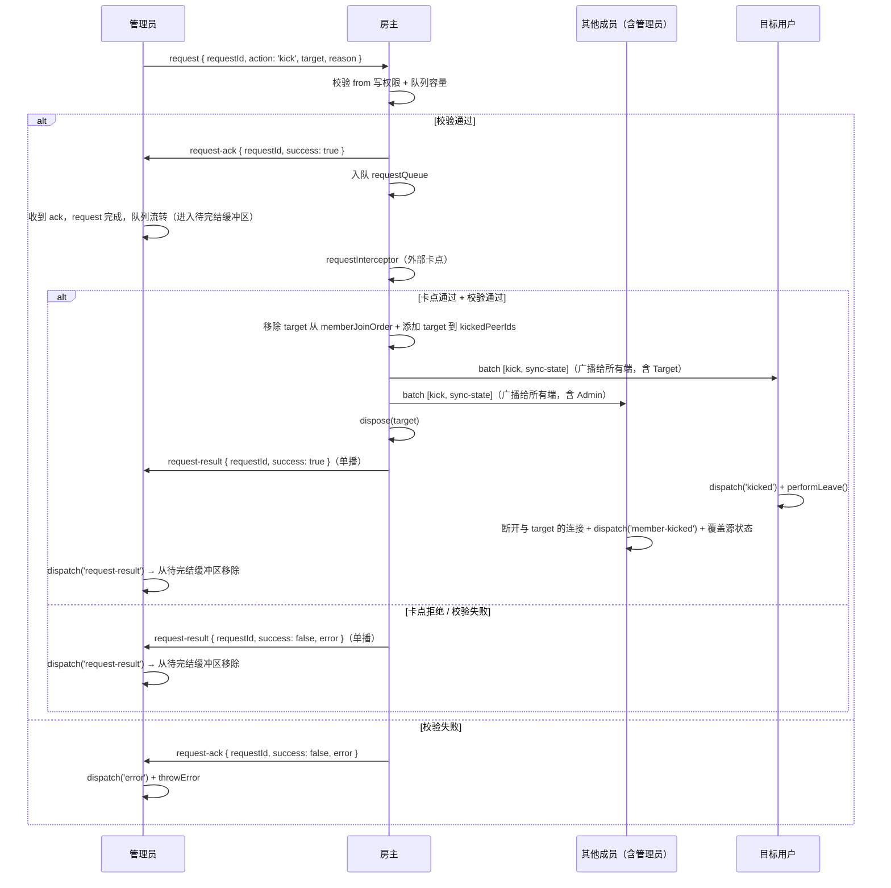

# RFC: rtcRoom 权限控制 — Request 队列机制

> scope: `src/shared/rtc-room/permissions/queue`
>
> parent: [RFC.md](./RFC.md)（版本与状态由主文档统一管理）

## 概述

本文档描述管理员与房主之间的 request 队列通信机制，包括管理员端串行队列、房主端 FIFO 队列、ack + result 两阶段流程、待完结缓冲区（awaitingResult）、cancelPendingRequests、以及 host-changed 自动重发。

## 管理员端串行 request 队列

管理员本地维护一个串行化的 request 队列（复用 `src/shared/priority-queue` 的入队/出队能力，当前场景所有 request 优先级相同，按入队顺序 FIFO 处理，不使用优先级能力），前一个 request 的 ack 返回或超时后，即可发送下一个 request。**收到 ack 表示队列流转**（房主已接受入队），管理员可继续发送下一个 request。

**requestId 生成与碰撞重试**：requestId 格式为 `${localPeerId}:${随机字符串}`，入队前检测本地队列内是否碰撞，碰撞则重新生成随机部分，最多重试 `parameters.requestIdRetryLimit ?? 5` 次；超过上限抛出 `REQUEST_ID_CONFLICT` 错误。详见 [RFC-core.md](./RFC-core.md) 中 requestId 生成规则章节。

## 待完结缓冲区（awaitingResult）

管理员收到 `ack(success=true)` 后，该 request 从发送队列移入**待完结缓冲区**（`awaitingResult: RequestMessage[]`）。收到对应 `request-result` 报文后才从缓冲区移除（任务真正完结）。房主变更时（收到 `host-changed` 事件），缓冲区中尚未收到 result 的 request **自动重发给新房主**（重新进入发送队列头部，保持原 requestId，新房主视为新 request 处理）。这保证了 transferHost / 继位场景下管理员的操作不会静默丢失。

**重发最终一致性保证**：host-changed 重发时，新房主视为全新 request 处理。无论旧房主是否已执行过该操作（含执行成功但广播前崩溃的场景），重发到新房主后的结果与正常执行一次的效果最终一致，无需额外的 requestId 去重机制。具体分三种场景：

- **旧房主已执行 + 已广播**：新房主 muteRegistry 已包含变更 → 重发触发去重（幂等）
- **旧房主已执行 + 未广播即崩溃**：新房主 muteRegistry 不含变更 → 重发等效首次执行
- **旧房主未执行**：重发等效首次执行

各操作的去重 / 首次执行行为：
- **kick**：目标已不在 `memberJoinOrder` 中 → 前置校验失败 → 回复 `result(success=false)`；目标仍在 → 正常执行
- **mute**：`applyMute` 内部去重（`rules.includes` 校验）→ 已存在时幂等（sync-state 无实质变化）；不存在时正常追加
- **unmute**：`applyUnmute` 中若 ruleKey 已被删除（精确匹配 `rules.find` 返回 null 且 `findNarrowestCover` 也返回 null）→ 无操作，回复 `result(success=true)`（规则已不存在，语义上等同成功）。注：若 ruleKey 本身不在 rules 中但被更粗粒度规则覆盖（如全禁仍在），重发会产生一个新的 exemption 条目（最终一致——旧房主已广播时 `exemptions.includes` 去重为幂等；未广播时等效首次添加），不影响正确性

即：三种场景下操作结果均为正确的最终状态，不会产生副作用或数据不一致。

待完结缓冲区通过 `room.awaitingRequests` 只读属性暴露。

**容量说明**：当前版本 `awaitingResult` 不设上限——管理员端串行发送（ack 驱动），且 P2P 场景房间规模有限（通常 < 20 人），实际缓冲区深度极低。Worst case = `maxPendingRequests`（64）× 管理员数量，P2P 场景下管理员通常不超过个位数，即最多几百条，内存开销可忽略。若后续扩展到大房间场景或需要防御极端情况，可引入容量上限（复用 `maxPendingRequests`）或为 result 设置超时清理机制。

> **⚠️ 内存泄漏风险**：若房主端 `requestInterceptor` 返回的 Promise 永不 settle（如内存泄漏、未处理的异步逻辑），对应的 `awaitingResult` 条目将永久驻留。当前版本依赖四条清理链路（见下方），但均以 result 报文送达或状态变更为前提。后续版本应引入 TTL 机制（如 `requestTimeout * 10`），超时后自动移除并 dispatch 告警事件，详见后续版本规划。

**清理链路保证**：`awaitingResult` 中的条目最终一定会被清理，不会无限驻留。完整清理路径如下：
- **正常路径**：房主执行完操作 → 单播 `request-result` → 管理员收到后从 `awaitingResult` 移除
- **房主断线路径**：房主断线 → member-left 触发 → 选举 → 新房主当选 → dispatch `host-changed` → 管理员收到 `host-changed` → `awaitingResult` 中所有未完结条目自动重发给新房主（移回发送队列头部）→ 新房主处理后回复 result → 最终清理
- **管理员被移除路径**：收到 `admin-removed` 事件（target === localPeerId）→ 内部监听器自动销毁 request 队列和 `awaitingResult`（整体清空）
- **用户主动离开路径**：`performLeave()` 清理所有本地状态，`awaitingResult` 随之销毁

## ack + result 两阶段流程

最终执行结果通过 result 报文异步通知——房主从队列取出 request 并执行后，向发起该 request 的管理员单播 `request-result` 报文，携带原始请求信息和成功/失败原因。

```text
管理员调用 kick/mute/unmute（非房主）:
  1. 构造 RequestMessage { type: 'request', requestId, action, target, scope?, reason? }
  2. 入队本地串行队列
  3. 队列头部 request 通过 __room_ctrl__ channel 发送给房主
  4. 等待 ack 响应（超时 = parameters.requestTimeout ?? 5000ms）
     - 超时 → dispatch('request-timeout', { requestId, action }) + throwError(RoomRequestTimeoutError)
     - 收到 ack(success=false) → dispatch('error', { code: 'REQUEST_REJECTED', ... }) + throwError(RoomRequestRejectedError)
     - 收到 ack(success=true) → request 移入 awaitingResult 缓冲区，队列流转（发送下一个）
  5. 等待 result 响应（异步，不阻塞队列流转）
     - 收到 request-result → 从 awaitingResult 移除 + dispatch('request-result', payload)
```

## cancelPendingRequests

支持 `cancelPendingRequests()` 取消所有排队中（尚未发送）的 request，返回 `{ cancelled: RequestMessage[]; inflight: RequestMessage | null }`（cancelled 为被取消的请求列表，inflight 为当前正在等待 ack 的请求，不可取消，无则为 null。业务侧可据 inflight 非 null 展示"有一个请求正在等待回复"的 UI 提示，告知用户当前仍有未完成的 request 在途）。

**cancelPendingRequests 后 inflight 的生命周期**：`cancelPendingRequests` 仅清空排队中的未发送项，不影响当前 inflight 的 request 生命周期。inflight 的 request 继续正常等待 ack：
- 收到 `ack(success=true)` → 正常移入 `awaitingResult`，后续等待 result
- 收到 `ack(success=false)` → 正常 dispatch error + throwError
- 超时 → 正常 dispatch timeout + throwError

即：cancel 是非侵入性的——只取消尚未发出的排队项，已发出的请求不受影响。

**cancelPendingRequests 触发时机**：
- 管理员被移除（收到 admin-remove 事件且 target === localPeerId）时自动调用，同时销毁 request 队列和待完结缓冲区。
  **触发点**：权限模块内部注册的 `admin-removed` 事件监听器中检测 `target === localPeerId`，自动执行清理。该监听器在 `createPermissionController` 初始化时注册，优先于业务侧的事件监听器执行。
- 用户主动调用（业务侧决定放弃排队中的操作。注意：cancelPendingRequests 仅清空排队中未发送的 request，不影响 awaitingResult 缓冲区）
- 管理员升级为房主时：发送队列中的 pending 请求 + 待完结缓冲区中的请求，统一移入房主端 requestQueue 作为待处理项（因为此时自己就是执行者，绕过 requestInterceptor，但按**新角色（host）的权限**进行目标合法性校验——升级后权限层级提升，原先作为 admin 不可执行的操作在成为 host 后可能变为合法）
- 管理员降级（被 removeAdmin）后：同"管理员被移除"路径，由内部 `admin-removed` 监听器自动触发

## 房主端 request 队列

房主本地维护一个 FIFO 队列（复用 `src/shared/priority-queue` 的入队/出队能力，当前场景不使用优先级能力），用于缓存已收到的 request。队列容量上限由 `parameters.maxPendingRequests`（默认 64）控制，超限时立即回复 `ack(success=false, error='queue full')`。

```text
房主收到 request 后:
  1. 校验写权限（from 的 ctrlChannelWritable）
  2. 校验队列容量
  3. 通过 → 回复 ack(success=true) + 将 request 入队: requestQueue.enqueue({ ...request, from })
  4. 逐个从队列取出处理:
     a. 调用 requestInterceptor（外部卡点）
     b. 校验目标合法性
     c. 执行操作 + 合并广播 batch
     d. 单播 result 给发起管理员
```

仅房主端初始化此队列，非房主不创建，避免不必要开销。transferHost 时旧房主销毁 requestQueue（清空残留 request，不回复 result——管理员端通过待完结缓冲区的 host-changed 重发机制恢复），新房主初始化 requestQueue。

**requestQueue 销毁与 requestInterceptor 异步守卫**：

销毁 requestQueue 时，可能存在正在被 `requestInterceptor` 处理的 request（异步 Promise 尚未 settle）。为防止 interceptor resolve/reject 后在已销毁的状态上执行操作，房主端 request 处理循环需引入 `disposed` 守卫：

```text
processNextRequest():
  request = requestQueue.dequeue()
  if (!request): return

  // self request（管理员升级为房主后移入队列的请求）绕过 requestInterceptor——
  // 这些请求的发起者就是当前房主自身，无需外部卡点确认。
  // 判断条件：request.from === localPeerId（升级流程中标记 from = localPeerId）
  if (request.from !== localPeerId):
    try:
      await requestInterceptor(request, request.from)
    catch (err):
      // 拦截器拒绝
      if (disposed): return  // 守卫：队列已销毁，静默丢弃
      sendResult(request, { success: false, error: err.message })
      processNextRequest()
      return

    if (disposed): return  // 守卫：等待 interceptor 期间队列被销毁（transferHost/分区败北），静默丢弃

  // interceptor 通过（或 self request 跳过），继续后续校验和执行：
  // 按 request.action 分派到对应操作的校验+执行逻辑：
  //   - action='kick'  → 见 RFC-kick.md「房主收到 request(action=kick)」步骤 2b-2c
  //   - action='mute'  → 见 RFC-mute.md「房主收到 request(action=mute)」步骤 6c-6e
  //   - action='unmute' → 见 RFC-mute.md「房主收到 request(action=unmute)」步骤 6c-6e
  // 各 action 的校验均以**执行时刻的角色和状态**为准（见设计决策「request 执行时刻权限」）
  validateAndExecute(request)
  processNextRequest()

destroyRequestQueue():
  disposed = true
  requestQueue.clear()
  // 此后 processNextRequest 中任何 await 返回都会命中 disposed 守卫
```

`disposed` 标记在 `destroyRequestQueue()` 中置为 true，`processNextRequest` 中每个 `await` 返回点后都检查该标记。这保证了：
- transferHost 销毁旧房主队列后，正在 interceptor 中的 request 不会在旧房主上执行操作
- 分区恢复败者销毁队列后，残留的异步 interceptor 不会触发广播/dispatch
- 管理员端通过 `awaitingResult` + `host-changed` 重发机制最终将这些 request 送达新房主

**房主端不做 requestId 碰撞检测**：requestId 的唯一性由发送方（管理员端）生成时保证，房主端仅用 requestId 匹配 result 回复，不做入队前碰撞校验。host-changed 重发时复用原 requestId，新房主视为全新 request 入队——即使两个不同管理员的 requestId 意外相同（概率极低），也不会导致逻辑错误，因为 result 单播给对应发送方，不会串台。

## 管理员端 host-changed 重发机制

管理员收到 `host-changed` 事件时，检查本地待完结缓冲区（awaitingResult）中是否有未收到 result 的 request。若有，将这些 request **自动重新入队到发送队列头部**（保持原 requestId），向新房主重发。新房主视为全新 request 处理（校验 + ack + 入队 + 执行）。若新房主回复 `ack(success=false)`（如权限已变更），管理员正常处理错误。

**时序保证**：`host-changed` 事件的 dispatch 时机保证了重发不会与新房主冲突——
- `performElected` 中 dispatch('host-changed') 在广播 batch（含 sync-state）**之后**（步骤 i）
- 管理员收到 batch 后按序处理：先处理 host-transfer（dispatch host-changed）→ 再处理 sync-state
- 即：管理员的 host-changed 监听器触发重发时，新房主已完成 requestQueue 初始化（performElected 步骤 d），具备接收和处理 request 的能力

## 管理员升级为房主的完整流程

transferHost 使当前管理员成为新房主，或投票式选举胜出时：

```text
执行顺序约束：步骤 1-4 必须在 dispatch('host-changed') 之前完成。
这保证了 host-changed 事件监听器执行时管理员队列已被销毁，
不会与 host-changed 重发机制产生竞争（重发监听器发现队列已空，无需操作）。

1. 收集本地管理员队列状态：发送队列中的 pending 请求 + 待完结缓冲区（awaitingResult）中未收到 result 的请求
2. 销毁管理员端 request 队列和待完结缓冲区
3. 初始化房主端 requestQueue
4. 将步骤 1 收集的所有请求统一移入房主端 requestQueue 作为待处理项（标记 `from = localPeerId`）
   // 注：此时 ctx.hostId === localPeerId（步骤 3 之前已当选），因此 from === ctx.hostId，
   // 后续校验逻辑中 `from === hostId` 成立，self request 自然走房主直接执行路径。
   //
   // **processNextRequest 启动时机**：步骤 4 仅入队不启动处理循环。
   // requestQueue 的处理循环由以下入口触发：
   // - performElected 步骤 h2：广播完成后显式调用 processNextRequest() 启动首轮处理
   // - 后续收到外部 request 消息时：onMessage handler 中入队后调用 processNextRequest
   // 即：步骤 4→广播期间队列仅入队不出队，保证 memberJoinOrder 清理（移除 prevHost）
   // 和广播均在队列消费之前完成。
5. dispatch('host-changed', ...)（此时管理员队列已不存在，host-changed 重发监听器无事可做）
6. 房主处理这些 self request 时：**绕过 requestInterceptor**，但按**新角色（host）的权限**进行目标合法性校验 → 执行。升级后权限层级提升，原先作为 admin 不可执行的操作（如踢其他管理员）在成为 host 后变为合法，这是 by design 的——待处理请求以**执行时刻的角色权限**为准
7. self request 的 result 通知行为：不发送 `request-result` 单播消息（自己就是执行者和发起者），
   直接本地 dispatch('request-result', { success, requestId, action, target, scope })，
   保持与正常 request 一致的事件语义，业务侧无需区分 self request 和普通 request
```

## 时序图

### 管理员 request 完整流程（ack + result 两阶段）



## 设计决策

| 决策点 | 选择 | 理由 |
|--------|------|------|
| request ack + result 两阶段 | ack 表示已接受入队（队列流转依据），result 报文异步通知最终执行结果（携带原始请求信息和成功/失败原因） | ack 解耦队列流转与执行结果，管理员可快速发送下一个 request；result 提供完整的结果反馈闭环，业务侧可据此更新 UI |
| 管理员 request 队列 | **串行化**（复用 `src/shared/priority-queue`，不使用优先级能力）：前一个 ack 返回或超时后即可发下一个 | 避免并发 request 导致状态不一致，队列流转仅依赖 ack，不阻塞等待 result |
| 房主端 request 队列 | FIFO 队列（复用 `src/shared/priority-queue`，不使用优先级能力），仅房主初始化，transferHost 时旧房主销毁+新房主初始化 | 缓存并发 request，逐个处理避免状态冲突；非房主不创建避免无谓开销；转让时保证队列生命周期正确 |
| 房主端队列上限 | `maxPendingRequests`（默认 64） | 防止恶意/大量管理员并发 request 导致内存无限膨胀 |
| requestInterceptor 外部卡点 | 房主端配置 async function，resolve=允许，reject=拒绝 | 业务侧可弹窗确认、频率限制、自定义规则校验，不传则默认全部允许 |
| request 执行时刻权限 | 以**执行时刻的角色和状态**为准，而非发起时刻 | request 在队列中排队期间，target 的角色可能已发生变化（如被提升为 admin、被 kick 等），校验必须基于当前最新状态。这保证了权限判断的实时正确性 |
| request 超时 | `requestTimeout` 配置（默认 5000ms） | 管理员明确感知操作超时，避免无限等待。超时后管理员端丢弃该 requestId，若房主后续回复 ack 则按 requestId 匹配不到，静默忽略 |
| requestId 生成 | `${peerId}:${随机串}`，仅用于匹配 ack，碰撞重试上限 `requestIdRetryLimit`（默认 5） | peerId 前缀仅为可读性，无结构化语义；超过重试上限抛 `REQUEST_ID_CONFLICT`（防御性兜底） |
| 待完结缓冲区 | awaitingResult: RequestMessage[]，收到 result 才移除 | 保证 transferHost/继位场景下操作不会静默丢失（host-changed 时自动重发） |
| host-changed 重发 | 缓冲区中未收到 result 的 request 自动重新入队到发送队列头部 | 新房主视为全新 request 处理，保证管理员操作最终被执行或明确拒绝 |
