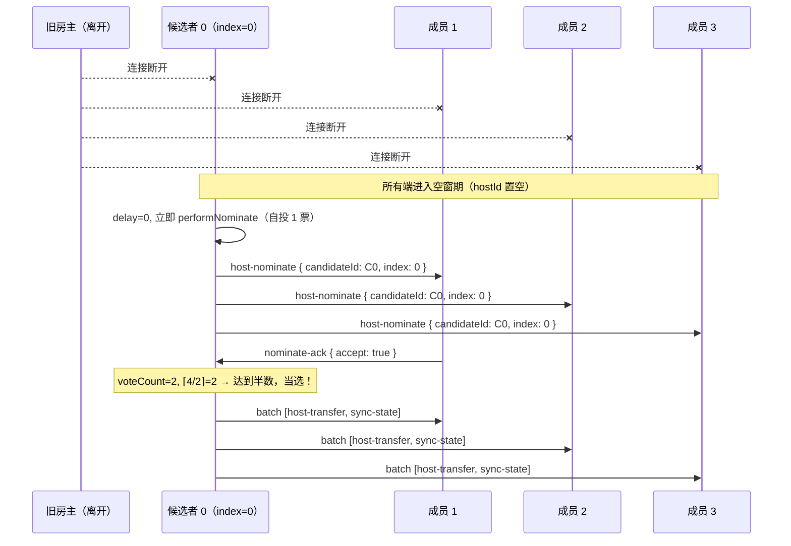
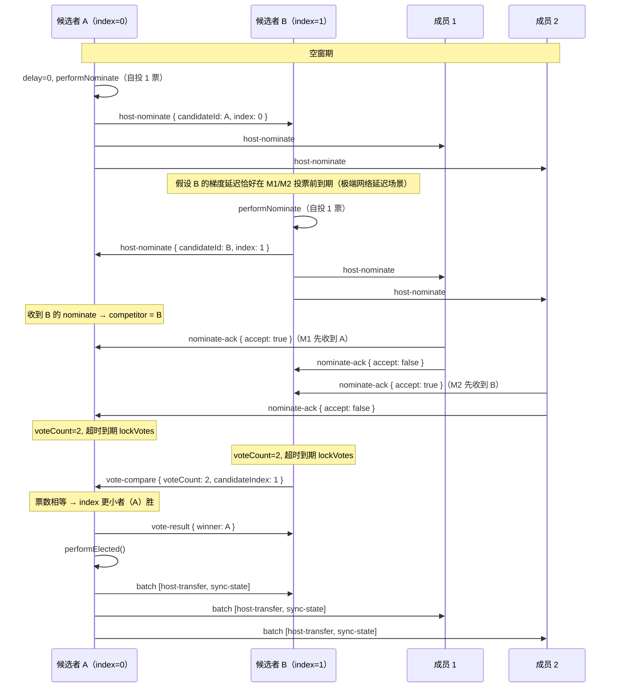
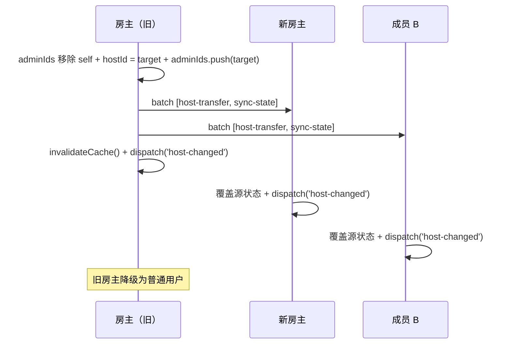

# RFC: rtcRoom 权限控制 — 角色管理

> scope: `src/shared/rtc-room/permissions/roles`
>
> parent: [RFC.md](./RFC.md)（版本与状态由主文档统一管理）

## 概述

本文档描述权限系统中的角色管理机制，包括房主协商（组网自动产生）、管理员指派/移除、房主转让、候选列表生成，以及房主离开后的自动继位入口。

> 房主继位采用**投票式选举**（梯度自荐 + 过半投票 + P2P 比票）
>
> 历史方案（竞赛式继位）已归档至 [archive/RFC-succession.md](./archive/RFC-succession.md)

## 房主协商（组网自动产生）

```text
performJoin 完成后（仅 switches.enablePermissions === true 时执行）:
  0. assertPermissionsEnabled()（前置开关断言）
  1. 建立 __room_ctrl__ DataChannel（所有用户均建立，默认只读）
  2. roomSignaling.join 返回 existingMembers
  3. 若 existingMembers 为空（无人在房间）→ 本地为第一个进房 → 自动成为房主:
     ctx.hostId = localPeerId
     ctx.adminIds.push(localPeerId)
     // ctrlChannelWritable 为 getter（派生自 adminIds + checkMute），房主加入 adminIds 后自动为 true，无需手动赋值
     若 switches.defaultRoomMute === true:
       ctx.muteRegistry.room = { rules: ['\0'], exemptions: [] }
  4. 若 existingMembers 非空 → 等待房主通过 __room_ctrl__ channel 下发 sync-state

注意：hostId 初始可为空字符串，收到 sync-state 后填充。

defaultRoomMute 生效时机说明：
  - 仅在**房主首次创建房间**时生效（步骤 3 中处理）
  - 后续加入的用户通过 sync-state 接收 muteRegistry（已包含全房间禁言状态），无需额外处理
  - 所有成员离开后房间自动销毁；后续以相同 roomId 加入视为**全新房间**，
    新房间的首任房主会重新应用 defaultRoomMute 配置（全新的房主协商、空的状态）
  - 即：defaultRoomMute 在每次房间从零创建时都会生效，不限于"首次使用该 roomId"

房主进入后立即触发 sync-state 广播（新 peer 连接时房主自动下发），
其余端通过 sync-state 接收到 muteRegistry 即包含全房间禁言状态，无需额外处理。

房间关闭语义：所有成员离开后房间自动关闭销毁，不存在重新进入旧房间的可能。
即使后续有用户以相同 roomId 加入，也视为一个全新的房间（全新的房主协商、空的状态）。
```

## 管理员操作

```text
addAdmin(targetPeerId):
  0. assertPermissionsEnabled(ctx)
  0.1. 前置校验：若 targetPeerId === '*' → 报错（addAdmin 不接受 '*'，仅 mute/unmute 可操作房间层）
  1. 断言 ctx.isHost === true（仅房主可指派管理员）
  1.1. 前置校验：若 ctx.adminIds.includes(targetPeerId) → 静默返回（幂等，目标已是管理员）
  2. ctx.adminIds.push(targetPeerId)
  3. 合并广播: { type: 'batch', events: [{ type: 'admin-add', target: targetPeerId, from: localPeerId }, { type: 'sync-state', ...payload }] }
  4. invalidateCache()
  5. dispatch('admin-added', { peerId: targetPeerId, from: localPeerId })

非房主端收到 admin-add 事件（通过 batch）:
  1. 仅 dispatch('admin-added', { peerId: target, from })
  （源状态 adminIds 由后续 sync-state 统一覆盖）

removeAdmin(targetPeerId):
  0. assertPermissionsEnabled(ctx)
  0.1. 前置校验：若 targetPeerId === '*' → 报错（removeAdmin 不接受 '*'，仅 mute/unmute 可操作房间层）
  1. 断言 ctx.isHost === true（仅房主可移除管理员）
  1.1. 前置校验：若 targetPeerId === ctx.hostId → 报错（不可移除房主的管理员身份，房主必须通过 transferHost 降级）
  1.2. 前置校验：若 !ctx.adminIds.includes(targetPeerId) → 静默返回（幂等，目标本就不是管理员）
  2. ctx.adminIds = ctx.adminIds.filter(id => id !== targetPeerId)
  3. 合并广播: { type: 'batch', events: [{ type: 'admin-remove', target: targetPeerId, from: localPeerId }, { type: 'sync-state', ...payload }] }
  4. invalidateCache()
  5. dispatch('admin-removed', { peerId: targetPeerId, from: localPeerId })

非房主端收到 admin-remove 事件（通过 batch）:
  1. 仅 dispatch('admin-removed', { peerId: target, from })
  （源状态 adminIds 由后续 sync-state 统一覆盖）
```

> 注：addAdmin / removeAdmin / transferHost 仅 host 可调用（`ctx.isHost === true`），而 host 永远免疫禁言，因此无需额外检查禁言状态。管理员的管理操作（kick / mute / unmute）通过 `ctrlChannelWritable` getter 控制——该 getter 综合考虑 adminIds 和 `__room_ctrl__` channel 的禁言状态。

## transferHost 流程

```text
房主调用 transferHost(targetPeerId):
  0. assertPermissionsEnabled(ctx)
  0.1. 前置校验：若 targetPeerId === '*' → 报错（transferHost 不接受 '*'，仅 mute/unmute 可操作房间层）
  0.2. 前置校验：若 targetPeerId === localPeerId → 报错（不可转让给自己，房主已是自身）
  1. 断言 ctx.isHost === true（仅房主可转让）
  2. prevHost = ctx.hostId
  3. 原子操作（以下步骤不可分割）:
     a. 从 ctx.adminIds 中移除 prevHost（移除旧房主的管理员身份，旧房主降级为普通用户）
     b. ctx.hostId = targetPeerId
     c. ctx.adminIds.push(targetPeerId)（新房主加入管理员）
     d. 销毁旧房主 requestQueue（调用 destroyRequestQueue，设置 disposed=true + 清空队列，
        详见 [RFC-request-queue.md](./RFC-request-queue.md)「requestQueue 销毁与 requestInterceptor 异步守卫」）：
        清空队列中所有残留 request（这些 request 的 ack 已在入队前回复过，无需再通知管理员），
        然后置空 ctx.requestQueue
  4. 旧房主禁言立即生效：muteRegistry 中已有的针对 prevHost 的禁言条目，
     转让后 prevHost 不再享有 host 免疫，这些条目立即生效（checkMute 自然命中）
  5. 合并广播: { type: 'batch', events: [{ type: 'host-transfer', prevHost, newHost, voteCount: ctx.memberJoinOrder.length, candidateIndex: -1 }, { type: 'sync-state', ...payload }] }
     // 注意：transferHost 是房主主动转让，非选举继位。voteCount=当前房间人数（ctx.memberJoinOrder.length，含房主自身）
     // 而选举中 voterTotal = memberJoinOrder.length - 1（显式排除 prevHost），因此 voteCount ≥ voterTotal + 1 > voterTotal，
     // 保证手动转让的 voteCount 严格大于任何选举能产生的票数。candidateIndex=-1 确保
     // 在 voteCount 相等时仍然胜出（-1 < 任何有效 index），使手动指定的房主在分区恢复仲裁中始终胜出
  6. invalidateCache()
  7. dispatch('host-changed', { prevHost, newHost })

注意：新房主的 requestQueue 初始化不在旧房主的原子操作中——新房主收到 sync-state 后，
在 sync-state 处理逻辑的第 3 步中检测到 isHost === true 且 requestQueue 未初始化，
此时自动初始化 requestQueue。详见 RFC-sync.md「状态同步与合并广播」中 sync-state 处理逻辑。

非房主端收到 host-transfer 事件（通过 batch）:
  1. 校验 prevHost === ctx.hostId（防止伪造，不匹配则忽略该事件）
  2. 临时更新本地 hostId: ctx.hostId = newHost（使后续 sync-state 的 from 校验能通过）
  3. dispatch('host-changed', { prevHost, newHost })
  （完整源状态由后续 sync-state 统一覆盖）
```

## 候选列表生成

`computeHostCandidates` 在 `buildSyncStatePayload()` 中实时调用（延迟计算），无需在每次状态变动时主动触发。每次房主构建 sync-state payload 时自动计算最新候选列表，确保广播出去的候选列表始终反映当前状态。

```text
computeHostCandidates():
  maxLen = parameters.maxCandidates ?? (ctx.memberJoinOrder.length - 1)

  // 收集有效候选者：排除房主自身 + 排除不适合成为房主的用户
  // 排除条件（满足任一即排除）：
  // 1. 被显式禁言 __room_ctrl__ channel（checkMute 传 channel='__room_ctrl__' 走用户级具名匹配）
  //    → 无法发送选举消息，不应成为候选者
  // 2. 被全禁（用户级或房间级，checkMute 不传 channel/event，匹配全禁标记 '\0'）
  //    → 虽然 __room_ctrl__ 免通配匹配（全禁不影响 __room_ctrl__ channel），
  //    但全禁意味着该用户在业务层面完全无法发言，不适合担任房主角色。
  //    **设计意图**：用户级全禁的管理员虽保留 __room_ctrl__ 写权限（ctrlChannelWritable 仍为 true），
  //    仍被排除出候选列表——全禁表示业务层面完全受限，即使有管理能力也不适合担任房主。
  //    这是 by design 的角色能力与候选资格的分离：管理能力（ctrlChannelWritable）决定能否执行管理操作，
  //    候选资格（checkMute 全禁检测）决定能否成为房主，两者独立判断。
  //    注意：仅 channel 级或 event 级禁言（如 mute(peerId, { channel: 'chat' })）不影响候选资格——
  //    checkMute(ctx, peerId) 不传 channel/event 时 buildTarget() 返回 '\0'，
  //    只有全禁标记 '\0' 能通过 findHighestGranularityMatch 匹配（rule === MUTE_SEP 显式判断），
  //    channel 级/event 级规则不会命中
  // 3. 房间级全禁生效时（room.rules 含 '\0'）：
  //    checkMute(ctx, peerId) 对非 admin 返回 true（房间层命中），对 admin 返回 false
  //    （roomMuteAffectsAdmin=false 时 admin 免疫房间层禁言），
  //    效果：房间级全禁时仅 admin 能进入候选列表——这是预期行为，
  //    房间全禁场景下只有管理员有实际管理能力，应优先由管理员继任房主
  //
  // 仅禁言 __room_ctrl__ 的某个特定 event 时不排除——
  // event 级禁言不影响 __room_ctrl__ channel 的整体写权限，该用户仍能参与选举。
  eligible = ctx.memberJoinOrder.filter(peerId =>
    peerId !== ctx.hostId &&
    !checkMute(ctx, peerId, '__room_ctrl__') &&
    !checkMute(ctx, peerId)
  )

  // 排序策略：管理员优先 → 按 memberJoinOrder 顺序
  admins = eligible.filter(id => ctx.adminIds.includes(id))
  nonAdmins = eligible.filter(id => !ctx.adminIds.includes(id))
  sorted = [...admins, ...nonAdmins]

  // 截取前 maxLen 个
  return sorted.slice(0, maxLen)
```

## 房主离开自动继位（投票式选举）

### 新增 ControlChannelMessage 类型

```typescript
/** 候选者广播自荐（空窗期内通过 __room_ctrl__ channel 广播给所有端） */
interface HostNominate {
  type: 'host-nominate';
  candidateId: string;       // 自荐者 peerId
  candidateIndex: number;    // 在 hostCandidates 中的 index
}

/** 成员回复投票（单播给候选者） */
interface NominateAck {
  type: 'nominate-ack';
  candidateId: string;       // 被投票的候选者 peerId
  accept: boolean;           // true = 投票支持；false = 拒绝（已投给其他人）
}

/** 比票请求：index 更大者（B）→ index 更小者（A）（单播） */
interface VoteCompare {
  type: 'vote-compare';
  peerId: string;            // 发送方 peerId
  voteCount: number;         // 锁定的票数
  candidateIndex: number;    // 发送方在 hostCandidates 中的 index
}

/** 比票结果：A → B（单播） */
interface VoteResult {
  type: 'vote-result';
  winner: string;            // 胜者 peerId
}
```

> 以上选举消息类型已纳入 [RFC-core.md](./RFC-core.md) 的 `ControlChannelMessage` 联合类型，此处不再重复定义。

### 新增配置项

> 选举相关配置项（`nominateTimeout`、`successionDelay`、`electionTimeout`、`maxCandidates`）已在 [RFC-core.md](./RFC-core.md) 的 `PermissionParameters` 中统一定义，此处不再重复。

### 阶段 1：空窗期 + 梯度自荐

```text
检测到 hostId 对应的 peer 已离开（member-left 事件触发）:
  1. 所有端进入空窗期:
     prevHost = ctx.hostId
     ctx.hostId = ''
     ctx.electionInProgress = true
     invalidateCache()
     dispatch('host-changed', { prevHost, newHost: '' })
     // 注：此处**不**从 memberJoinOrder 移除 prevHost。
     // memberJoinOrder 的修改权归房主独占（source-of-truth 语义），
     // 非房主端的 memberJoinOrder 在空窗期可能短暂包含已离开的 prevHost，
     // 这是 acceptable 的——选举完成后新房主广播的 sync-state 会统一覆盖，
     // 确保所有端最终收敛到一致状态。此设计保证了数据修改的唯一性，
     // 避免多端并发修改 memberJoinOrder 导致状态分叉。
     // 注：newHost 为空字符串表示"进入选举态，当前无房主"。
     // 业务侧可据此显示选举中 UI（如 loading 态）。
     // 不使用独立的 'election-started' 事件是为了保持事件语义一致——
     // 房主变更始终通过 host-changed 通知，空字符串是合法的中间态。
     管理请求进入本地缓冲区（不发出）
     votedFor = null（初始化投票记录。自荐时设为 localPeerId，投给他人时设为对方 peerId；非 null 即表示"已投票"）

  2. 各 peer 检查自己是否在 hostCandidates 中:
     myIndex = ctx.hostCandidates.indexOf(localPeerId)
     if (myIndex === -1) → 不参与选举，等待 host-transfer

  3. 候选者启动梯度延迟（仅在梯度窗口期内允许自荐）:
     delay = myIndex * (parameters.successionDelay ?? 3000)
     nominateTimer = setTimeout(delay, performNominate)
     // 注：只有梯度计时器到期时仍持有自荐资格（未投票给他人）才执行 performNominate
```

### 阶段 2：自荐与投票收集

```text
performNominate（梯度延迟到期，发起自荐）:
  // 注：本函数全同步执行，guard 与赋值之间无 await 点，不存在异步竞态窗口。
  0. guard：if (votedFor !== null) return（已参与投票（含自投）则放弃自荐，防止重复执行或 clearTimeout 竞态）
  1. votedFor = localPeerId（标记已自投，阻止后续收到他人 nominate 时误投）
  2. 广播: { type: 'host-nominate', candidateId: localPeerId, candidateIndex: myIndex }
  3. 初始化本地选举状态:
     voteCount = 1（自投 1 票）
     voteLocked = false
     competitor = null（竞争者 peerId，仅记录第一个收到的竞争者）
     voterTotal = ctx.memberJoinOrder.filter(id => id !== prevHost).length
     // voterTotal 快照说明：
     // - 基于 performNominate 执行时刻的 memberJoinOrder，filter 显式排除 prevHost
     //  （空窗期各端 memberJoinOrder 可能不一致——房主端已移除 prevHost 而非房主端尚未移除，
     //   filter 抹平此差异，保证所有端计算出相同的 voterTotal）
     // - 包含 localPeerId 自身（自投 1 票），不含空窗期**新加入**的挂起 peer（pendingPeers）
     //   注：空窗期之前已在 memberJoinOrder 中的成员（即使此刻已断线）仍计入 voterTotal，
     //   断线成员无法投票的问题由超时兜底覆盖（nominateTimeout 到期后 lockVotes）
     // - 选举期间不动态调整（成员离开由超时兜底覆盖，见"选举边界行为"章节）
     // - 过半阈值 = ⌈voterTotal / 2⌉，小房间（≤3 人）自投即当选：
     //
     //   | 房间人数（排除 prevHost） | voterTotal | 阈值 | 自投即当选？ |
     //   |--------------------------|-----------|------|------------|
     //   | 1                        | 1         | 1    | ✅          |
     //   | 2                        | 2         | 1    | ✅          |
     //   | 3                        | 3         | 2    | ❌ 需 1 票   |
  4. 启动投票超时计时器:
     voteTimer = setTimeout(parameters.nominateTimeout ?? 3000, lockVotes)

成员收到 host-nominate:
  if (votedFor !== null):  // 已投票（含自荐者自投 votedFor=localPeerId 和已投给他人的情况）
    单播回复: { type: 'nominate-ack', candidateId: msg.candidateId, accept: false }
  else:
    单播回复: { type: 'nominate-ack', candidateId: msg.candidateId, accept: true }
    标记已投票: votedFor = msg.candidateId
    清除自身梯度计时器（若存在）→ 放弃自荐资格（不再允许发出 host-nominate）

候选者收到 nominate-ack:
  if (msg.accept && !voteLocked):
    voteCount++
    检查是否达到半数: if (voteCount >= Math.ceil(voterTotal / 2)):
      进入快速当选路径 → clearTimeout(voteTimer) → performElected()

候选者收到其他人的 host-nominate（竞争出现）:
  if (competitor !== null):
    // 已有竞争者，忽略后续 nominate（只与第一个竞争者比票）
    return
  competitor = msg.candidateId
  competitorIndex = msg.candidateIndex
  // 不立即比票，等待自己的投票超时后锁票再比
```

### 阶段 3：决议

```text
lockVotes（投票超时到期，锁定票数）:
  voteLocked = true

  if (competitor === null):
    // 无竞争者 → 超时兜底，不管票数直接当选
    performElected()
  else:
    // 有竞争者 → 进入比票流程，按 index 决定角色
    if (myIndex < competitorIndex):
      // 本地是 A（主导方）→ 等待 B 发来 vote-compare
      startCompareTimeout(parameters.nominateTimeout ?? 3000, () => {
        // B 未在超时内发来 vote-compare → B 可能断线，A 直接当选
        performElected()
      })
    else:
      // 本地是 B（被动方）→ 主动发送 vote-compare 给 A
      sendTo(competitor, { type: 'vote-compare', peerId: localPeerId, voteCount, candidateIndex: myIndex })
      startCompareTimeout(parameters.nominateTimeout ?? 3000, () => {
        // A 未在超时内回复 vote-result → A 可能断线，B 直接当选
        performElected()
      })

快速当选路径 performElected():
  // 超时内票数过半（不管有无竞争者都直接当选）
  执行升级 → host-transfer + sync-state（见阶段 4）
```

### 阶段 3.5：P2P 比票（仅竞争场景）

```text
比票角色确定:
  index 更小者 = A（主导方，做最终校验）
  index 更大者 = B（被动方，先发送自己的票数）

B 锁票后（由 lockVotes 中的分支触发）:
  单播给 A: { type: 'vote-compare', peerId: localPeerId, voteCount: B.voteCount, candidateIndex: B.myIndex }

A 收到 vote-compare:
  1. 校验总票数: if (A.voteCount + B.voteCount > voterTotal):
     // 结果不一致（可能有投票重复计数），以 A 为准。
     // 注：此处 voterTotal 使用 A 自己的快照。A 和 B 的 voterTotal 可能略有差异
     // （performNominate 时刻不同，期间可能有成员离开），但不影响最终结果——
     // 总票数校验仅作为防御性断言，即使 A 和 B 的 voterTotal 不同导致
     // A.voteCount + B.voteCount > A.voterTotal，比票逻辑仍以绝对票数比较为准，
     // 无论是否命中该分支，比票流程都会产出唯一确定性 winner。
     winner = A.localPeerId
  2. 否则比较票数:
     if (A.voteCount > B.voteCount): winner = A.localPeerId
     if (B.voteCount > A.voteCount): winner = B.peerId
     if (A.voteCount === B.voteCount):
       // 平票 → hostCandidates index 更小者优先
       winner = A.localPeerId（A 的 index 必然更小）
  3. 单播给 B: { type: 'vote-result', winner }
  4. if (winner === A.localPeerId): A 执行 performElected()
     else: A 放弃，等待 B 的 host-transfer

B 收到 vote-result:
  if (winner === B.localPeerId): B 执行 performElected()
  else: B 放弃，等待 A 的 host-transfer
```

### 阶段 4：正式继位

```text
/**
 * performElected()
 * prevHost 来自阶段 1 中 member-left 检测时的快照变量（闭包持有），
 * 在整个选举生命周期内不可变。
 */
performElected():
  a. ctx.hostId = localPeerId
  a2. ctx.electionVoteCount = voteCount  // 记录当选票数（用于分区恢复仲裁）
  a3. ctx.electionCandidateIndex = myIndex  // 记录当选时的候选列表 index（用于仲裁 tiebreaker）
  b. ctx.electionInProgress = false（解除空窗期）
  c. ctx.adminIds.push(localPeerId)（新房主加入管理员）
  d. 处理本地管理员队列 + 初始化房主端 requestQueue（详见 [RFC-request-queue.md](./RFC-request-queue.md)「管理员升级为房主的完整流程」步骤 1-4）
     // 注：步骤 d 中步骤 1-3 收集并销毁管理员队列、初始化房主端 requestQueue，步骤 4 将 self request 移入 requestQueue。
     // 移入队列 ≠ 立即执行——实际从队列取出执行发生在 processNextRequest 循环中（FIFO 延迟处理），
     // 此时步骤 e（memberJoinOrder 移除 prevHost）和步骤 h（广播 batch）已完成。
     // 因此若 self request 的 target === prevHost，校验会因目标不在 memberJoinOrder 中而失败，
     // 回复 result(success=false)——这是预期行为，prevHost 已离开，操作无意义。
  e. ctx.memberJoinOrder = ctx.memberJoinOrder.filter(id => id !== prevHost)
     // 此操作确保后续 buildSyncStatePayload 中 computeHostCandidates 计算的候选列表不含 prevHost
  e2. delete ctx.muteRegistry.users[prevHost]（清理离开房主的禁言条目，与 member-left 处理一致）
  f. 处理空窗期挂起的 peer（ctx.pendingPeers）：
     for peerId of ctx.pendingPeers:
       if (ctx.kickedPeerIds.includes(peerId)):
         transport.disconnect(peerId)（被踢用户拒绝）
       else:
         try:
           transport.createCtrlChannel(peerId)（为挂起 peer 建立 __room_ctrl__ channel——
             挂起期间未建立，此处补建，使后续广播能送达）
           ctx.memberJoinOrder.push(peerId)
         catch:
           // createCtrlChannel 失败（如底层 PeerConnection 已被对端关闭）→ 跳过该 peer，
           // 不加入 memberJoinOrder，等待其自行重连（重连后走正常 peer-reconnected 流程）
     ctx.pendingPeers = []（清空挂起队列）
  g. invalidateCache()
  h. 广播: { type: 'batch', events: [
       { type: 'host-transfer', prevHost, newHost: localPeerId, voteCount, candidateIndex: myIndex },
       // host-transfer 中的 voteCount/candidateIndex：直接使用闭包持有的选举快照值（阶段 2 锁定）
       // buildSyncStatePayload 中的 voteCount/candidateIndex：从 ctx.electionVoteCount/ctx.electionCandidateIndex 读取（步骤 a2/a3 已写入 ctx）
       // 两者值相同，但来源不同——前者显式构造字面量，后者通过 ctx 间接获取
       buildSyncStatePayload()
     ] }
     // 注：广播在 pendingPeers 处理（含 __room_ctrl__ channel 建立）之后，
     // buildSyncStatePayload 中的 memberJoinOrder 和 hostCandidates（延迟计算）已包含挂起 peer。
     // 此时所有 peer（含原挂起 peer）均已建立 __room_ctrl__ channel，
     // transport.broadcast 一次广播即可覆盖全员。
  h2. 启动 requestQueue 处理循环：processNextRequest()
      // 步骤 d 将 self request 移入 requestQueue 时不立即启动处理循环。
      // 步骤 d→h 期间队列仅入队不出队——外部 request 在此窗口到达时仅执行 ack + 入队，
      // 不触发 processNextRequest（处理循环尚未启动）。
      // 此处显式启动，保证步骤 e（移除 prevHost）和步骤 h（广播）均已完成后才开始消费队列，
      // self request 若 target===prevHost 将正确地校验失败（prevHost 已不在 memberJoinOrder 中）。
  i. dispatch('host-changed', { prevHost, newHost: localPeerId })
```

### assertControlPermission 空窗期豁免

空窗期（`hostId === ''`）时，以下消息类型豁免权限校验：

- `host-nominate`
- `nominate-ack`
- `vote-compare`
- `vote-result`
- `host-transfer`（选举胜出后的正式通知）

### 选举边界行为

**投出 ack 后的成员**：清除自身梯度计时器（放弃选举资格），等待 host-transfer + sync-state。若长时间未收到 host-transfer（候选者也断线），由房主空窗期超时兜底重新触发选举。

**全候选者断线（所有 hostCandidates 中的成员在选举期间全部离开）**：
- 非候选成员（不在 hostCandidates 中）无自荐资格，无法主动发起选举
- 此场景由**选举全局超时**兜底：所有端在进入空窗期时启动 `electionTimeout` 计时器，超时时间 = `Math.max((hostCandidates.length) * successionDelay + nominateTimeout * 2 + 1000, nominateTimeout * 3)`（覆盖最坏情况：最后一个候选者梯度到期 + 投票超时 + 比票超时 + 1s 网络延迟余量；Math.max 保证最小值下限，防止某端 hostCandidates 为空时过早触发重算）
- 超时到期后若 `ctx.hostId` 仍为空字符串（未收到 host-transfer）：
  - 重新计算候选列表（基于当前 memberJoinOrder 中仍可达的成员——即本地 PeerConnection 状态为 connected 的 peer，排除已离开的候选者）
  - 若新候选列表非空 → 重置选举状态（`votedFor = null`、`competitor = null`、`voteCount = 0`、`voteLocked = false`、清除 `nominateTimer`/`voteTimer`/`compareTimer`），以新候选列表重新开始阶段 1（梯度自荐）。注：第一轮中已投给断线候选者的票自然失效——断线候选者无法完成选举（其 host-transfer 永远不会到达），这些投票不需要"回收"或撤销，重置 `votedFor = null` 后所有成员在新一轮中重新投票即可
  - 若新候选列表为空（房间仅剩自己）→ 自动当选为房主（voterTotal=1，自投即当选）
  - 若房间无人（所有人都离开）→ 房间自动销毁，performLeave
  - **各端独立重算的一致性**：超时重算使用本地 `memberJoinOrder` 快照，各端可能因感知成员离开的时机不同而产生不同的候选列表。这是 acceptable 的——投票机制（过半当选 + 比票仲裁）保证最终收敛到唯一房主。极端情况下（多端各自计算出不同候选列表并各自完成选举）复用双房主分区恢复仲裁逻辑裁决唯一房主。

**候选者在选举过程中断线**：已投票给该候选者的成员不会收到 host-transfer；其他候选者的梯度延迟到期后自荐 → 正常选举流程。

**比票期间一方断线**：
- B 断线（A 等待 vote-compare）：A 在比票超时（nominateTimeout）后未收到 → A 直接当选
- A 断线（B 等待 vote-result）：B 在比票超时后未收到 → B 直接当选

**选举期间成员离开（voterTotal 动态变化）**：
- `voterTotal` 在 `performNominate` 时快照，选举期间**不动态调整**
- 若多个成员在选举期间陆续离开，可能导致"票数永远无法达到半数"的情况
- 此场景由**超时兜底**覆盖：`nominateTimeout` 到期后 `lockVotes` 执行，无竞争者时不管票数直接当选；有竞争者时进入比票流程，以实际收到的绝对票数比较——比票不依赖 voterTotal 阈值，因此不受成员动态离开影响
- 即：选举最终一定能在有限时间内产出房主，不会死锁

**3+ 候选者同时自荐（极端网络延迟场景）**：
- 正常情况下梯度延迟（默认 3000ms）足以保证候选者逐个自荐，不会产生 3+ 竞争
- 极端网络延迟（> successionDelay）导致多个候选者在收到其他人的 nominate 前完成自荐时：
  - 每个候选者**只记录收到的第一个** `host-nominate` 作为 competitor，后续 nominate 忽略
  - 这可能导致多对候选者各自独立完成比票，**产生多个 winner**（每对比票产出一个胜者）
  - 多个 winner 各自广播 `host-transfer` + `sync-state` → 其他端检测到双房主冲突 → **复用分区恢复仲裁逻辑**（比较 voteCount + candidateIndex）裁决唯一房主，败者自动降级
- 此设计复用已有的双房主仲裁代码路径，无需为 3+ 竞争者引入额外协议

**空窗期新成员加入**：
- 空窗期（`electionInProgress === true`）时，**所有已有 peer** 在 transport 层 peer-connected 回调中统一检查 `ctx.electionInProgress`，若为 true 则将该 peer 加入 `ctx.pendingPeers` 挂起队列（保持 P2P 连接但不处理权限逻辑），不加入 memberJoinOrder
- **挂起 peer 不建立 `__room_ctrl__` channel**——该 channel 的建立延迟到选举完成后新房主处理 pendingPeers 时统一执行。因此挂起 peer 无法接收或发送任何控制消息，不会参与选举投票，也不会影响房间权限状态
- 选举完成（`electionInProgress = false`）后，新房主在 `performElected` 中从 `ctx.pendingPeers` 取出所有挂起 peer，建立 `__room_ctrl__` channel → 执行 kick 缓存校验 → memberJoinOrder.push，然后统一广播 sync-state（一次广播覆盖全员，含挂起 peer）。非房主端收到 sync-state 后自动清理本地 `pendingPeers`
- 挂起期间业务消息收发不受影响，仅权限相关逻辑（`__room_ctrl__` 建立、sync-state 下发、memberJoinOrder 维护）延迟到选举完成后执行

### 网络分区与分区恢复仲裁

**分区期间**：
- 不同分区各自完成选举（各自能凑够过半的前提是分区内人数 > 总人数/2，数学上只有一个分区满足）
- 极端情况（如 3:3 分区且两侧都无法过半）：双方都走超时兜底当选，产生双房主

**触发条件**：分区恢复后，P2P 连接重新建立。收到对方的 sync-state 时，本地检测到 `payload.hostId !== localPeerId && ctx.isHost === true`——即双方都声称自己是房主，产生冲突。

**仲裁规则**（两级比较，确保确定性结果）：
1. 比较票数（`voteCount`），票多者胜
2. 票数相等时，比较 `candidateIndex`（hostCandidates 中的 index），index 更小者胜
   - `transferHost` 手动转让时 `candidateIndex = -1`，保证手动指定的房主在仲裁中始终胜出

**败者降级完整流程**：

```text
收到 sync-state 且 payload.hostId !== localPeerId 且 ctx.isHost === true（双房主冲突）:
  localMeta = { voteCount: ctx.electionVoteCount, candidateIndex: ctx.electionCandidateIndex }
  remoteMeta = { voteCount: payload.voteCount, candidateIndex: payload.candidateIndex }

  localWins =
    localMeta.voteCount > remoteMeta.voteCount ||
    (localMeta.voteCount === remoteMeta.voteCount && localMeta.candidateIndex < remoteMeta.candidateIndex)

  if (!localWins):
    // 本地败北 → 降级流程（不 kick，仅状态回退）
    a. ctx.hostId = payload.hostId
    b. // 无操作——adminIds 在步骤 d 由胜者 sync-state 统一覆盖，此处无需手动修改。
       // 步骤 a→d 窗口安全性：整段降级逻辑全同步执行（无 await 点），不会有外部代码在此窗口内
       // 读取 adminIds。唯一的异步路径是 processNextRequest 中的 interceptor await 返回，
       // 但步骤 c 已将 disposed 置为 true，interceptor 恢复后命中 disposed 守卫直接 return，
       // 不会走到读取 adminIds 或 isHost 的后续逻辑。因此步骤 a→d 窗口内 adminIds 的中间态不可观测。
    c. 显式调用 destroyRequestQueue() 销毁本地 requestQueue（host 专属资源，降级后释放）:
       // 注：此处必须显式调用 destroyRequestQueue()，而非依赖步骤 d 中 sync-state 处理逻辑的自动检测。
       // 原因：步骤 a 已将 ctx.hostId 改为胜者 peerId，此时 ctx.isHost === false，
       // 步骤 d 的 sync-state 处理逻辑（第 3 步）检测到 isHost === false 且 requestQueue 已存在时
       // 也会触发销毁——但显式调用保证销毁在 sync-state 覆盖之前完成，
       // 避免 disposed 守卫与 sync-state 状态覆盖之间的时序依赖。
       //
       // **disposed 守卫约束**：processNextRequest 中所有 await 返回点的守卫条件
       // 仅检查 `if (disposed): return`，不检查 ctx.isHost 或 ctx.hasAdminPermission。
       // 这保证了步骤 a→d 窗口内（ctx.hostId 已改但 adminIds 尚未覆盖），
       // 正在 await 的 interceptor 恢复时一定命中 disposed 守卫（步骤 c 已置 disposed=true），
       // 不会走到读取 adminIds 或 isHost 的后续逻辑。
       - 队列中残留的 request 丢弃。这些 request 不会丢失——完整恢复链路：
         败者曾回复 ack(success=true) → 管理员已将对应 request 移入 awaitingResult →
         步骤 f dispatch host-changed → 管理员的 host-changed 监听器检测到 awaitingResult 非空 →
         自动将未完结 request 重新入队到发送队列头部 → 向新房主（胜者）重发
    d. 接受胜者 sync-state 覆盖本地全部源状态（同正常 sync-state 处理流程，
       此时 requestQueue 已被步骤 c 销毁，sync-state 第 3 步检测到 isHost === false 且 requestQueue 不存在，跳过）
    e. invalidateCache()
    f. dispatch('host-changed', { prevHost: localPeerId, newHost: payload.hostId })
    // 败者分区内的其他成员：
    // - 收到胜者广播的 sync-state 后自动覆盖，无需败者额外广播
    // - 管理员收到 host-changed 事件后，awaitingResult 中的未完结请求自动重发给新房主
  else:
    // 本地胜出 → 忽略对方 sync-state，向对方单播自己的 sync-state 使其同步
    sendTo(payload.hostId, { type: 'batch', events: [buildSyncStatePayload()] })
```

**状态收敛保证**：
- 仲裁结果是确定性的——同一对选举元数据，任何端计算出的 winner 相同
- 胜者向败者单播 sync-state，败者覆盖本地状态后与胜者一致
- 败者分区内的其他成员通过后续的 P2P 重连接收到胜者的 sync-state，逐步收敛
- 管理员的未完结请求通过 `host-changed` → `awaitingResult` 重发机制最终送达新房主，操作不会静默丢失

**房间仅剩一人**：voterTotal = 1，自投 1 票 → 1 ≥ ⌈1/2⌉ = 1 → 立即当选 ✅

**败者处理**：选举失败的候选者**保持原有角色不变**——原来是管理员仍为管理员，原来是普通用户仍为普通用户。其本地 request 队列和待完结缓冲区也维持原状，由后续 sync-state 覆盖源状态后自然恢复正常工作流。

## 管理员升级为房主的完整流程

> 完整步骤（收集队列 → 销毁 → 初始化 → 移入 → dispatch → self request 处理 → result 通知）见 [RFC-request-queue.md](./RFC-request-queue.md)「管理员升级为房主的完整流程」，此处不再重复。

## 时序图

### 投票式选举（正常路径，无竞争）



### 投票式选举（竞争路径，P2P 比票）



### transferHost 流程



## 设计决策

> 通用角色与权限决策（房主产生、房主标识、房主冗余、房主免疫、管理员操作、admin 自解禁、身份校验等）见 [RFC-core.md](./RFC-core.md) 设计决策表。以下仅列出**选举与继位特有的决策**。

| 决策点 | 选择 | 理由 |
|--------|------|------|
| 房主离开继承 | **投票式选举**：梯度自荐 + 过半投票 + P2P 比票 | 多数认可的合法性，防脑裂 |
| 候选列表生成 | 优先管理员 → 按 memberJoinOrder 顺序，排除被禁言 `__room_ctrl__` 的用户 | 管理员优先保证管理连续性 |
| 候选列表长度 | 默认 = 房间人数 - 1，支持 `maxCandidates` 配置 | 免除兜底逻辑 |
| 梯度自荐延迟 | `idx * successionDelay`（默认 3000ms） | index=0 立即自荐，其他候选者仅窗口到期且未投票时才可自荐。小房间（≤3 人）空窗期体感明显，推荐：2 人房间 1000ms、3-5 人房间 2000ms、6+ 人房间保持默认 3000ms |
| 当选条件 | 票数 ≥ ⌈成员数/2⌉（达到半数） | 防止多人同时当选 |
| 投票规则 | 自投 1 票 + 先到先投 + 每人仅一票 | 简单确定性，自投保证单人房间直接当选 |
| 比票方式 | P2P 单播（B→A→B），index 更小者为主导方 A | 省带宽、强共识，双方握手后有唯一确定结果 |
| 比票超时 | 复用 `nominateTimeout`（默认 3000ms） | 投票收集和比票都是选举中的延迟容忍阶段，语义一致，避免配置膨胀 |
| 平票处理 | index 更小者胜 | 确定性兜底，A 天然优先 |
| 超时兜底 | 无竞争者且超时 → 不管票数直接当选 | 覆盖部分成员不可达场景 |
| 3+ 候选者竞争 | 只记录第一个 competitor，多余 winner 由分区仲裁裁决 | 复用已有双房主仲裁逻辑，无额外协议开销 |
| transferHost 选举元数据 | voteCount=ctx.memberJoinOrder.length, candidateIndex=-1 | 手动转让的 voteCount ≥ 任何选举票数（选举票数 ≤ 房间人数），candidateIndex=-1 在 voteCount 相等时仍胜出，确保手动指定的房主在仲裁中始终胜出 |
| 败者处理 | 保持原有角色，队列和缓冲区维持原状 | 由 sync-state 覆盖自然恢复 |
| 房主空窗期 | 所有端置空 hostId，管理请求进入本地缓冲区 | 避免向不存在的房主发送 request |
| 空窗期权限豁免 | 选举相关消息（host-nominate/nominate-ack/vote-compare/vote-result/host-transfer）免校验 | 选举期间候选者还不是房主/管理员，但需发送控制消息 |
| 房主转让后旧房主身份 | 降级为普通用户（移出 adminIds） | 权限干净交接 |
| 转让后禁言生效 | 旧房主降级后 muteRegistry 中已有禁言立即生效 | checkMute 不再命中 host 免疫 |
