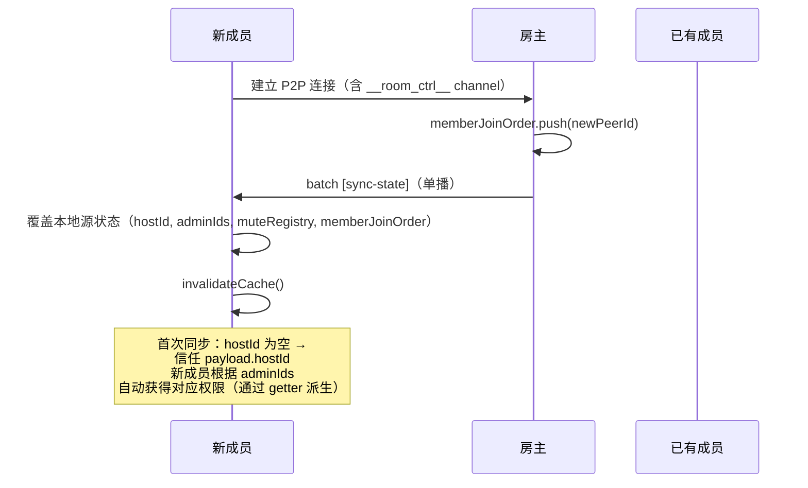

# RFC: rtcRoom 权限控制 — 状态同步与合并广播

> scope: `src/shared/rtc-room/permissions/sync`
>
> parent: [RFC.md](./RFC.md)（版本与状态由主文档统一管理）
>
> 依赖: [RFC-request-queue.md](./RFC-request-queue.md)（request 队列处理流程）、[RFC-roles.md](./RFC-roles.md)（选举与分区恢复仲裁）

## 概述

本文档描述权限系统的状态同步机制，包括 batch 合并广播格式、sync-state 处理逻辑、serialize/deserialize 数据校验、memberJoinOrder 维护规则。

## 核心原则

所有权限操作最终由房主执行并合并广播，将控制事件与 sync-state 合为一个 batch chunk 发送，减少 channel 流量。

**管理员操作流向**：
- 房主直接操作 → 本地执行 + 合并广播 batch
- 管理员操作 → 向房主发 request → 房主校验后执行 + 合并广播 batch

## batch 消息格式

```typescript
/**
 * batch 消息格式
 *
 * **重要约束**：events 数组的最后一个元素**必须**是 sync-state。
 * 接收方按序处理 events，先处理控制事件（dispatch 通知），最后通过 sync-state 覆盖源状态。
 * 若 sync-state 不在末尾，会导致中间态不一致（控制事件 handler 中读到的状态已被覆盖）。
 */
interface BatchMessage {
  type: 'batch';
  events: [...RoomControlEvent[], SyncStateEvent];  // 最后一个元素**必须**是 sync-state
}
```

**batch 运行时断言**：发送 batch 前、接收 batch 后均断言 `events[events.length - 1].type === 'sync-state'`，不满足则 throwError（`RoomIllegalOperationError`），阻断后续逻辑。

```text
assertBatchShape(batch):
  if (typeof batch !== 'object' || batch === null):
    throwError('batch', 'batch 消息格式非法：期望 object', RoomIllegalOperationError)
  if (!Array.isArray(batch.events) || batch.events.length === 0 || batch.events[batch.events.length - 1].type !== 'sync-state'):
    throwError('batch', 'batch 消息的最后一个元素必须是 sync-state', RoomIllegalOperationError)
```

> 注：`assertBatchShape` 仅校验 batch 结构（数组非空 + 末尾为 sync-state），不校验 events 内部各元素的 type 合法性。events 内部类型由各 handler 分支独立校验，未知 type 静默忽略（不 dispatch、不 throwError），避免因版本差异导致新消息类型被误判为非法。

## buildSyncStatePayload

```text
buildSyncStatePayload():
  return {
    type: 'sync-state',
    hostId: ctx.hostId,
    adminIds: ctx.adminIds,
    muteRegistry: serialize(ctx.muteRegistry),
    memberJoinOrder: ctx.memberJoinOrder,
    kickedPeerIds: ctx.kickedPeerIds,
    hostCandidates: computeHostCandidates(),   // 每次构建 payload 时实时计算，避免维护 dirty 标记
    voteCount: ctx.electionVoteCount,          // 选举元数据，用于分区恢复仲裁
    candidateIndex: ctx.electionCandidateIndex  // 选举元数据，用于分区恢复仲裁
  }
```

## 状态同步触发时机

### 新 peer 连接后（peer-connected 事件）

```text
  0. 空窗期挂起加入（所有 peer 执行）：若 ctx.electionInProgress === true → 挂起该连接（保持 P2P 连接但不处理），不加入 memberJoinOrder
     // 选举期间房间无房主，无法下发完整 sync-state，新成员加入将导致状态不一致。
     // 所有已有 peer 在 transport 层 peer-connected 回调中统一检查 ctx.electionInProgress，
     // 若为 true 则将该 peer 加入 ctx.pendingPeers 挂起队列（仅记录 peerId，不初始化权限相关逻辑）。
     // **挂起前先检查 kickedPeerIds**——若 ctx.kickedPeerIds.includes(newPeerId)，
     // 即使处于空窗期也立即拒绝连接（dispose），不加入 pendingPeers。
     // 这减少了空窗期的安全窗口——被踢用户无需等到选举完成才被拦截。
     // （kickedPeerIds 在所有端通过 sync-state 同步，非房主端也持有缓存副本）
     // **挂起 peer 不建立 `__room_ctrl__` channel**——该 channel 的建立延迟到选举完成、
     // 新房主处理 pendingPeers 时统一执行。因此挂起 peer 无法接收或发送任何控制消息，
     // 不会参与选举投票，也不会影响房间权限状态。
     // 选举完成后（electionInProgress = false），新房主在 performElected 中从 ctx.pendingPeers 取出所有挂起 peer，
     // 建立 __room_ctrl__ channel → 执行 kick 缓存校验 → memberJoinOrder.push，
     // 然后统一广播 sync-state（一次广播覆盖全员，含挂起 peer）。
     // 挂起期间业务消息正常收发不受影响。
  以下步骤仅房主执行:
  1. 校验 newPeerId 是否在 kickedPeerIds 中:
     若 ctx.kickedPeerIds.includes(newPeerId) → 拒绝连接（dispose 该 peer 的 controller），不加入 memberJoinOrder
  2. ctx.memberJoinOrder.push(newPeerId)
  3. 单播给新 peer: { type: 'batch', events: [buildSyncStatePayload()] }
     注：即使只有单条 sync-state，也统一使用 batch 包装，保持接收方处理路径一致（始终走 batch handler）
```

### 断线重连后（peer-reconnected 事件）

```text
  注：transport 层对所有端触发 onMemberReconnect 回调。
  非房主端收到回调时直接忽略（if (!ctx.isHost) return），不执行以下逻辑。
  重连校验和状态同步均由房主端独占执行。

  以下步骤仅房主执行：
  0. 校验 reconnectedPeerId 是否在 kickedPeerIds 中:
     若 ctx.kickedPeerIds.includes(reconnectedPeerId) → 拒绝重连（dispose 该 peer 的 controller）
  重连的 peer 可能在断线期间错过了状态变更，房主应主动同步：
  1. 单播给重连 peer: { type: 'batch', events: [buildSyncStatePayload()] }
```

### 成员离开后（member-left 事件，仅房主执行）

```text
  0. 若 leftPeerId === ctx.hostId → 房主离开，进入选举流程（详见 RFC-roles.md「房主离开自动继位」），
     以下步骤不执行（选举完成后新房主在 performElected 中统一处理 prevHost 的清理）
  1. ctx.memberJoinOrder = ctx.memberJoinOrder.filter(id => id !== leftPeerId)
  2. ctx.adminIds = ctx.adminIds.filter(id => id !== leftPeerId)
  3. delete ctx.muteRegistry.users[leftPeerId]（清理离开用户的禁言条目，减少 sync-state 体积）
  4. 清理 requestQueue 中 from === leftPeerId 的残留 request（丢弃，不回复 result——
     对端已断线，单播 result 无法送达，管理员端 performLeave 已销毁本地状态）
  5. invalidateCache()
  6. 广播: { type: 'batch', events: [buildSyncStatePayload()] }
```

> 注：离开的用户相关状态需同步清理——adminIds 中的残留 peerId 会影响候选列表排序（管理员优先）、
> muteRegistry.users 中的残留条目会增大 sync-state 体积且语义无效（该用户不在房间内）。
> kick 场景中这些清理已在 kick 流程中显式处理（见 RFC-kick.md），此处覆盖的是**主动离开/断线离开**场景。

## 收到 batch 消息的处理

**原子性保证**：收到 batch 后，先执行 `assertBatchShape(batch)`（见上方断言），再对 events 末尾的 sync-state 执行 `assertDataShape(deserialize 校验)`。若任一校验失败，**整个 batch 丢弃**（不处理其中任何控制事件），dispatch error 后终止。这确保不会出现"控制事件已 dispatch 但源状态未覆盖"的中间态。

校验通过后，按序处理 events 数组中的每个事件。

### 收到 host-transfer 事件时

```text
  0. assertControlPermission(ctx, from, 'host-transfer')
     // host-transfer 的合法性由 assertControlPermission 保证：
     // - 非空窗期：from 必须是当前 hostId（仅房主可发送 host-transfer）
     // - 空窗期（选举态）：host-transfer 属于豁免消息类型，允许通过（选举胜出者发送）
     // 因此无需额外校验 voteCount / candidateIndex 的合理性——
     // 若 from 不具备写权限，assertControlPermission 会阻断并 dispatch 越权事件。
  1. 校验 prevHost:
     若 ctx.electionInProgress === true（空窗期）→ 跳过 prevHost 校验
       // 选举态下 ctx.hostId 已被置为 ''，而 host-transfer 中的 prevHost 是旧房主 peerId（非空），
       // 两者必然不等。空窗期的 host-transfer 来自选举胜出者，其合法性已由步骤 0 的
       // assertControlPermission 空窗期豁免保证，无需重复校验 prevHost。
     否则（非空窗期）→ 校验 prevHost === ctx.hostId（防止伪造，不匹配则忽略该事件）
       // 注：若 prevHost !== ctx.hostId 且 ctx.isHost === true，表示双房主分区恢复场景——
       // 对方分区的旧房主不等于本地的 hostId，此处 host-transfer 被跳过，
       // 由后续 sync-state 处理逻辑中的双房主仲裁（比较 voteCount + candidateIndex）裁决唯一房主。
       // 详见 RFC-roles.md「网络分区与分区恢复仲裁」章节。
  2. 临时更新本地 hostId: ctx.hostId = newHost（使后续 sync-state 的 from 校验能通过）
  3. dispatch('host-changed', { prevHost, newHost })
```

### 收到 sync-state 时

```text
校验逻辑：
  - 若本地 hostId 为空字符串（首次同步）→ 信任 payload.hostId，用 payload.hostId 校验 from
  - 若本地 hostId 非空 → 断言 from === ctx.hostId（防止伪造）
处理：
  1. 直接覆盖本地源状态（不合并，以房主为准）:
     ctx.hostId = payload.hostId
     ctx.adminIds = [...payload.adminIds]
     ctx.muteRegistry = deserialize(payload.muteRegistry)
     ctx.memberJoinOrder = [...payload.memberJoinOrder]
     ctx.kickedPeerIds = [...payload.kickedPeerIds]
     ctx.hostCandidates = [...payload.hostCandidates]
     ctx.electionVoteCount = payload.voteCount
     ctx.electionCandidateIndex = payload.candidateIndex
  2. invalidateCache()（清除所有派生状态缓存）
  3. requestQueue 生命周期管理:
     - 若 ctx.isHost === true 且 ctx.requestQueue 未初始化 → 初始化 requestQueue
     - 若 ctx.isHost === false 且 ctx.requestQueue 已存在 → 销毁 requestQueue
       （清空残留 request，这些 request 的 ack 已在入队前回复过，无需再通知管理员）
  4. 空窗期恢复（非房主端）:
     若 ctx.electionInProgress === true 且 payload.hostId !== ''（收到新房主的 sync-state）:
       ctx.electionInProgress = false
       ctx.pendingPeers = []（清空本地挂起队列——新房主已统一处理并纳入 memberJoinOrder）
  // 注：sync-state 纯同步状态，不触发任何业务事件（如 muted/unmuted）。
  // 禁言通知由 batch 中的 mute/unmute 控制事件单独 dispatch，避免重复触发。
```

### 房主收到 request 消息（管理员发来的操作请求）

> 完整的 request 处理流程（ack + result 两阶段、队列管理、拦截器等）见 [RFC-request-queue.md](./RFC-request-queue.md)。此处仅列出 sync-state 视角下的关键步骤。

```text
  1. 校验写权限 + 队列容量 → 回复 ack
  2. 入队 requestQueue → 逐个取出处理（校验 + 执行）
  3. 执行成功后：合并广播 batch（控制事件 + sync-state）+ 单播 result 给发起管理员
```

## memberJoinOrder 维护

```text
memberJoinOrder: string[]
记录所有成员的加入顺序（数组保持插入顺序），用于候选列表生成时的排序依据。

维护时机：
  - performJoin 成功后：if (!memberJoinOrder.includes(localPeerId)) memberJoinOrder.push(localPeerId)
  - 收到 existingMembers 时：按返回顺序依次 push（push 前 includes 校验去重）
  - peer-connected 事件触发时：if (!memberJoinOrder.includes(newPeerId)) memberJoinOrder.push(newPeerId)（房主端在 sync-state 中同步）
  - member-left / kick 后：从 memberJoinOrder 中移除 peerId

sync-state 扩展：
  - 房主下发 sync-state 时携带 memberJoinOrder: ctx.memberJoinOrder
  - 新 peer 收到后直接覆盖本地：ctx.memberJoinOrder = payload.memberJoinOrder

性能说明：
  includes 去重为 O(n) 操作，当前设计接受此开销——rtc-room 为 P2P 场景，
  实际房间规模受限于 WebRTC mesh 拓扑（通常 < 20 人），O(n) 不构成瓶颈。
  若后续扩展到大房间场景（SFU 架构），可引入 Set 辅助去重。
```

## serialize / deserialize（MuteRegistry 序列化）

> 由于 `MuteRegistry` 的所有字段本身就是 JSON 兼容类型（`string[]` + `Record<string, MuteRuleSet>`），serialize/deserialize 的主要职责是**数据校验**而非类型转换。

```text
serialize(muteRegistry: MuteRegistry) → SerializedMuteRegistry:
  return { room: { ...muteRegistry.room }, users: { ...muteRegistry.users } }

deserialize(data: unknown) → MuteRegistry:
  assertDataShape(data, 'muteRegistry')
  return data as MuteRegistry

/**
 * 断言数据类型（基于 `src/shared/data-handler` 的 dataHandler 函数实现）
 * 校验失败时 dispatch error 事件 + throwError
 */
assertDataShape(data: unknown, context: string):
  // 顶层必须是 object 且含 room + users
  if (typeof data !== 'object' || data === null):
    onAssertFail(`${context}：期望 object`)
  if (!('room' in data) || !('users' in data)):
    onAssertFail(`${context}：缺少 room 或 users 字段`)

  // room 必须是 MuteRuleSet
  assertRuleSet(data.room, `${context}.room`)

  // users 必须是 Record<string, MuteRuleSet>
  if (typeof data.users !== 'object' || data.users === null):
    onAssertFail(`${context}.users：期望 object`)
  for [key, value] of Object.entries(data.users):
    assertRuleSet(value, `${context}.users[${key}]`)

assertRuleSet(value: unknown, path: string):
  if (typeof value !== 'object' || value === null):
    onAssertFail(`${path}：期望 object`)
  if (!Array.isArray(value.rules) || !value.rules.every(r => typeof r === 'string')):
    onAssertFail(`${path}.rules：期望 string[]`)
  if (!Array.isArray(value.exemptions) || !value.exemptions.every(r => typeof r === 'string')):
    onAssertFail(`${path}.exemptions：期望 string[]`)
  // 注：不校验 exemptions 中的条目是否有对应的 rules 覆盖（即不检测"孤立豁免"）。
  // 当前版本信任房主端数据完整性——applyMute/applyUnmute 保证了 rules 与 exemptions 的一致性。
  // 若因 bug 或版本差异产生孤立 exemptions，不影响正确性（checkMute 中无匹配 rule 时
  // exemptions 单独存在返回 'exempt'，等效于无禁言，不会误禁）。

function onAssertFail(message: string):
  const err = new RoomSyncStateInvalidError(message)
  dispatch('error', { code: 'SYNC_STATE_INVALID', error: err, message, context: 'syncState', rawData: data })
  throwError('deserialize', message, RoomSyncStateInvalidError)
```

## 时序图

### 新成员加入 + 状态同步



## 设计决策

> 通用状态同步决策（派生状态、非房主端状态操作、状态同步方向、断线重连、memberJoinOrder 类型选择）见 [RFC-core.md](./RFC-core.md) 设计决策表「状态同步」分组。以下仅列出**本模块特有的决策**。

| 决策点 | 选择 | 理由 |
|--------|------|------|
| 序列化无版本字段 | SerializedMuteRegistry 不含 version | 非持久化房间，不考虑跨版本兼容。不同 SDK 版本的 peer 加入同一房间若结构不匹配，解析时 assertDataShape 报错，由业务侧通知用户刷新页面以同步版本。中长期也不会引入 version 字段 |
| batch 末尾约束 | events 最后一个元素必须是 sync-state | 保证控制事件先处理（dispatch），最后统一覆盖源状态 |
| 单条 sync-state | 也用 batch 包装 | 保持接收方处理路径一致（始终走 batch handler） |
| sync-state 不触发业务事件 | sync-state 处理仅覆盖源状态 + invalidateCache，不 dispatch muted/unmuted 等事件 | 禁言通知由 batch 中 mute/unmute 控制事件单独 dispatch，避免每次 sync-state 重复触发 |
| 空窗期挂起（非拒绝） | 选举期间新 peer 连接挂起到 pendingPeers 队列，选举完成后新房主逐个处理 | 避免新成员需要手动重连，选举完成后自动恢复，体验更好 |
| 空窗期挂起前 kick 校验 | 挂起前先检查本地 kickedPeerIds，命中则立即拒绝（不加入 pendingPeers） | 减少空窗期安全窗口——被踢用户无需等到选举完成才被拦截。kickedPeerIds 通过 sync-state 在所有端同步，非房主端也持有缓存副本 |
| hostCandidates 延迟计算 | 在 buildSyncStatePayload() 中调用 computeHostCandidates() 实时计算 | 避免每次状态变动时主动触发重算，减少冗余计算，一次 sync-state 构建保证候选列表最新 |

## 后续版本规划

| 计划 | 说明 |
|------|------|
| serialize/deserialize 压缩 | 后续版本考虑对 sync-state payload 进行压缩，降低大房间场景下 DataChannel 单帧体积 |
| memberJoinOrder 冗余优化 | 后续版本考虑在 sync-state 中仅在成员变动时同步 memberJoinOrder，减少每次全量传输的冗余 |
| sync-state 增量同步 | 后续版本考虑在频繁操作场景下引入增量同步（delta），避免每次全量传输完整 muteRegistry |
| exemptions 增长控制 | 频繁细粒度 unmute 可能导致 exemptions 数组持续增长。后续版本考虑引入上限或定期合并冗余豁免条目（如被更粗粒度豁免覆盖的细粒度豁免可合并移除） |
| kickedPeerIds 容量控制 | `kickedPeerIds` 在房间生命周期内只增不减，长期存在的房间或频繁踢人场景下数组持续增长并增大 sync-state 体积。后续版本考虑引入容量上限（如 256）或 TTL 清理策略（如超过一定时间后自动移除旧条目） |
| awaitingResult TTL | 管理员端 `awaitingResult` 缓冲区当前依赖 result 报文 / host-changed 重发 / 管理员移除 / 用户离开四条路径清理。若房主端 `requestInterceptor` 的 Promise 永不 settle（内存泄漏等极端场景），对应条目将永久驻留。后续版本考虑为 `awaitingResult` 条目引入 TTL（如 `requestTimeout * 10`），超时后自动移除并 dispatch 告警事件 |
| sync-state payload 大小预估 | `kickedPeerIds` + `memberJoinOrder` + `muteRegistry` 全量序列化后可能逼近 DataChannel 单帧上限（通常 16KB-64KB）。后续版本考虑在 `buildSyncStatePayload` 中增加 payload 大小预估，超过阈值时输出 warn 日志，提前预警体积膨胀 |
