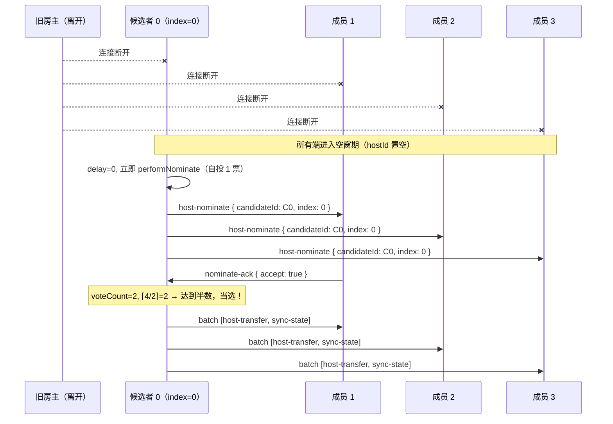
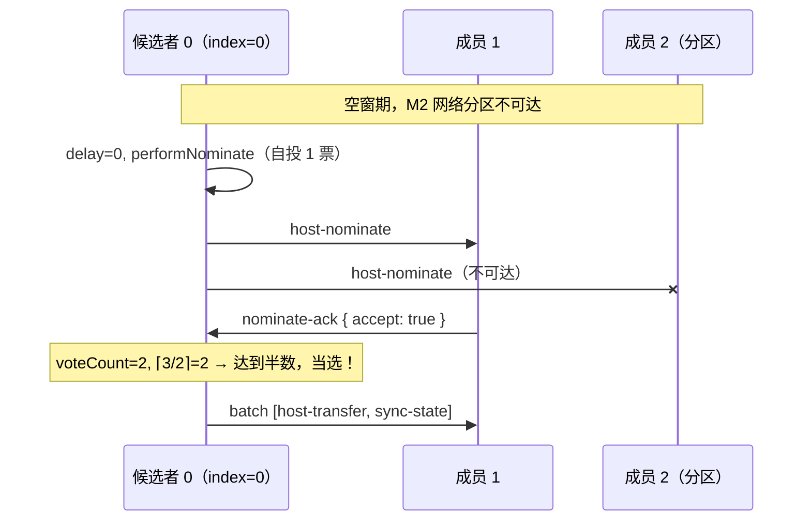
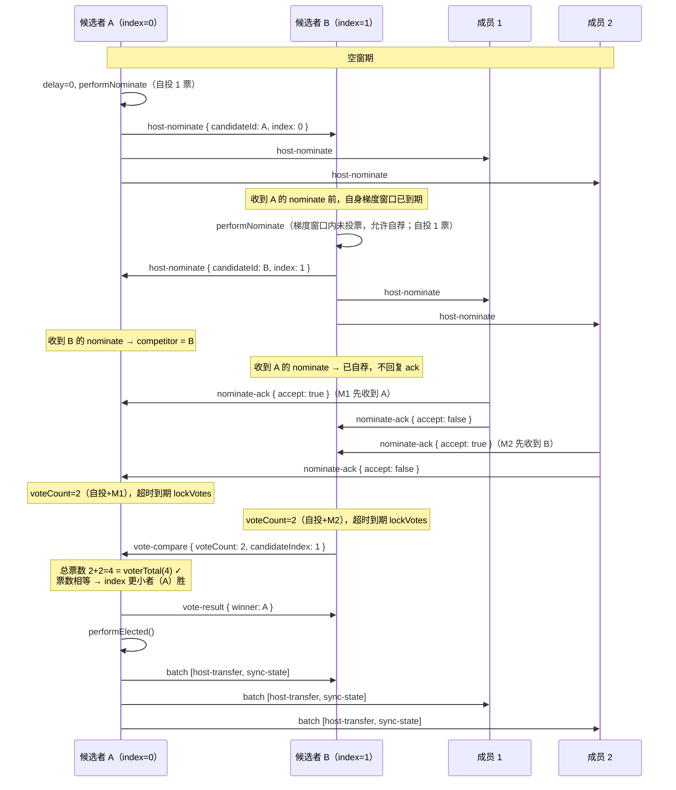

# RFC: rtcRoom 房主选举 — 投票式继位

> status: accepted
>
> author: cmtlyt
>
> create time: 2026/05/22 15:15:00
>
> rfc version: 0.1.0
>
> scope: `src/shared/rtc-room/permissions/roles/`
>
> parent: [RFC-permissions.md](./RFC-permissions.md)

## 背景与动机

当前 RFC-permissions 中的竞赛式继位（梯度延迟 + tiebreaker）存在以下不足：

- **缺乏共识性**：单方面声明即成为房主，其他端被动接受，无"多数认可"的合法性
- **脑裂风险**：网络分区场景下可能产生多个"房主"，需要复杂的 tiebreaker 逻辑恢复
- **tiebreaker 依赖时钟**：虽然 elapsedSinceDisconnect 基于本地时钟，但比较两端各自的本地计算值仍存在不确定性

本 RFC 将竞赛式继位替换为**投票式选举**，通过过半投票 + P2P 比票机制产生唯一房主，提供更强的共识保证。

## 设计概述

```text
房主离开 → 空窗期 → 梯度自荐（host-nominate）→ 投票收集 → 决议 → host-transfer + sync-state
```

选举结果通过现有的 `host-transfer` + `sync-state` 机制广播给所有端，与主动转让（`transferHost()`）共用后续流程。

## 新增 ControlChannelMessage 类型

```typescript
/** 候选者广播自荐（空窗期内通过 __room_ctrl__ channel 广播给所有端） */
interface HostNominate {
  type: 'host-nominate';
  candidateId: string;       // 自荐者 peerId
  candidateIndex: number;    // 在 hostCandidates 中的 index
}

/** 成员回复投票（单播给候选者） */
interface NominateAck {
  type: 'nominate-ack';
  candidateId: string;       // 被投票的候选者 peerId
  accept: boolean;           // true = 投票支持；false = 拒绝（已投给其他人）
}

/** 比票请求：index 更大者（B）→ index 更小者（A）（单播） */
interface VoteCompare {
  type: 'vote-compare';
  peerId: string;            // 发送方 peerId
  voteCount: number;         // 锁定的票数
  candidateIndex: number;    // 发送方在 hostCandidates 中的 index
}

/** 比票结果：A → B（单播） */
interface VoteResult {
  type: 'vote-result';
  winner: string;            // 胜者 peerId
}
```

更新 `ControlChannelMessage` 联合类型：

```typescript
type ControlChannelMessage =
  | RoomControlEvent | RequestMessage | RequestAck | RequestResult
  | HostNominate | NominateAck | VoteCompare | VoteResult;
```

## 新增配置项

```typescript
interface PermissionParameters {
  // ... 现有配置 ...

  /**
   * 选举投票超时时间（ms，默认 3000）
   * 候选者发出自荐后，等待 ack 的最大时间。超时后锁定票数进入决议阶段。
   */
  readonly nominateTimeout?: number;
}
```

## 完整流程

### 阶段 1：空窗期 + 梯度自荐

```text
检测到 hostId 对应的 peer 已离开（member-left 事件触发）:
  1. 所有端进入空窗期:
     prevHost = ctx.hostId
     ctx.hostId = ''
     invalidateCache()
     dispatch('host-changed', { prevHost, newHost: '' })
     管理请求进入本地缓冲区（不发出）

  2. 各 peer 检查自己是否在 hostCandidates 中:
     myIndex = ctx.hostCandidates.indexOf(localPeerId)
     if (myIndex === -1) → 不参与选举，等待 host-transfer

  3. 候选者启动梯度延迟（仅在梯度窗口期内允许自荐）:
     delay = myIndex * (parameters.successionDelay ?? 3000)
     nominateTimer = setTimeout(delay, performNominate)
     // 注：只有梯度计时器到期时仍持有自荐资格（未投票给他人）才执行 performNominate
```

### 阶段 2：自荐与投票收集

```text
performNominate（梯度延迟到期，发起自荐）:
  1. 广播: { type: 'host-nominate', candidateId: localPeerId, candidateIndex: myIndex }
  2. 初始化本地选举状态:
     voteCount = 1（自投 1 票）
     voteLocked = false
     competitor = null（竞争者 peerId）
     voterTotal = ctx.memberJoinOrder.length - 1（不含已离开的房主）
  3. 启动投票超时计时器:
     voteTimer = setTimeout(parameters.nominateTimeout ?? 3000, lockVotes)

成员收到 host-nominate:
  if (已投票给其他候选者):
    单播回复: { type: 'nominate-ack', candidateId: msg.candidateId, accept: false }
  else:
    单播回复: { type: 'nominate-ack', candidateId: msg.candidateId, accept: true }
    标记已投票: votedFor = msg.candidateId
    清除自身梯度计时器（若存在）→ 放弃自荐资格（不再允许发出 host-nominate）

候选者收到 nominate-ack:
  if (msg.accept && !voteLocked):
    voteCount++
    检查是否达到半数: if (voteCount >= Math.ceil(voterTotal / 2)):
      进入快速当选路径 → clearTimeout(voteTimer) → performElected()

候选者收到其他人的 host-nominate（竞争出现）:
  competitor = msg.candidateId
  competitorIndex = msg.candidateIndex
  // 不立即比票，等待自己的投票超时后锁票再比
```

### 阶段 3：决议

```text
lockVotes（投票超时到期，锁定票数）:
  voteLocked = true

  if (competitor === null):
    // 无竞争者 → 超时兜底，不管票数直接当选
    performElected()
  else:
    // 有竞争者 → 进入比票流程
    进入比票阶段

快速当选路径 performElected():
  // 超时内票数过半（不管有无竞争者都直接当选）
  执行升级 → host-transfer + sync-state（见阶段 4）
```

### 阶段 3.5：P2P 比票（仅竞争场景）

```text
比票角色确定:
  index 更小者 = A（主导方，做最终校验）
  index 更大者 = B（被动方，先发送自己的票数）

B 锁票后:
  单播给 A: { type: 'vote-compare', peerId: localPeerId, voteCount: B.voteCount, candidateIndex: B.myIndex }

A 收到 vote-compare:
  1. 校验总票数: if (A.voteCount + B.voteCount > voterTotal):
     // 结果不一致（可能有投票重复计数），以 A 为准
     winner = A.localPeerId
  2. 否则比较票数:
     if (A.voteCount > B.voteCount): winner = A.localPeerId
     if (B.voteCount > A.voteCount): winner = B.peerId
     if (A.voteCount === B.voteCount):
       // 平票 → hostCandidates index 更小者优先
       winner = A.localPeerId（A 的 index 必然更小）
  3. 单播给 B: { type: 'vote-result', winner }
  4. if (winner === A.localPeerId): A 执行 performElected()
     else: A 放弃，等待 B 的 host-transfer

B 收到 vote-result:
  if (winner === B.localPeerId): B 执行 performElected()
  else: B 放弃，等待 A 的 host-transfer
```

### 阶段 4：正式继位

```text
performElected():
  a. ctx.hostId = localPeerId
  b. ctx.adminIds.push(localPeerId)（新房主加入管理员）
  c. 初始化 requestQueue
  d. 处理本地缓冲区中的挂起请求（作为新房主直接执行）
  e. ctx.hostCandidates = computeHostCandidates()
  f. ctx.memberJoinOrder = ctx.memberJoinOrder.filter(id => id !== prevHost)
  g. invalidateCache()
  h. 广播: { type: 'batch', events: [
       { type: 'host-transfer', prevHost, newHost: localPeerId, timestamp: Date.now(), elapsedSinceDisconnect: 0 },
       buildSyncStatePayload()
     ] }
  i. dispatch('host-changed', { prevHost, newHost: localPeerId })
```

## assertControlPermission 空窗期豁免

空窗期（`hostId === ''`）时，以下消息类型豁免权限校验（选举期间所有候选者和投票者都需要发送这些消息）：

- `host-nominate`
- `nominate-ack`
- `vote-compare`
- `vote-result`
- `host-transfer`（选举胜出后的正式通知）

```text
function assertControlPermission(ctx, from, eventType):
  assertPermissionsEnabled(ctx)

  // 空窗期豁免选举相关消息
  electionEvents = ['host-nominate', 'nominate-ack', 'vote-compare', 'vote-result', 'host-transfer']
  if (ctx.hostId === '' && electionEvents.includes(eventType)):
    return  // 放行

  // ... 现有校验逻辑 ...
```

## 时序图

### 正常路径（无竞争，过半当选）



### 超时兜底（部分成员不可达）



### 竞争路径（P2P 比票）



## 设计决策

| 决策点 | 选择 | 理由 |
|--------|------|------|
| 选举触发 | 保持梯度延迟 + 窗口约束 | index=0 的候选者 delay=0 立即自荐；其他候选者仅在自身梯度窗口到期且未投票时才可自荐 |
| 投票规则 | 自投 1 票 + 先到先投 + 每人仅一票 | 简单确定性规则，自投保证单人房间直接当选 |
| 当选条件 | 票数 ≥ ⌈成员数/2⌉（达到半数） | 防止多人同时当选，奇数成员时等同过半，偶数成员时允许恰好半数当选 |
| 超时兜底 | 超时内无竞争者 → 不管票数直接当选 | 覆盖部分成员不可达场景，避免永远无法选出房主 |
| 比票方式 | P2P 单播（B→A→B） | 省带宽、强共识（双方握手后有唯一确定结果），比广播+独立判断更可靠 |
| 比票主导方 | hostCandidates index 更小者为 A | 确定性角色分配，A 做最终裁决 |
| 平票处理 | index 更小者胜 | 确定性兜底，A 天然优先 |
| 不一致处理 | 以 A 为准，不 kick | 不一致更可能是网络延迟导致而非恶意，过激处罚不合理 |
| 比票期间新 ack | 不计入（锁票后不再更新） | 保证比票快照一致性，避免无限等待 |
| 空窗期 assertControlPermission | 豁免选举相关消息 | 选举期间 hostId 为空，候选者还不是房主/管理员，但需要发送控制消息 |
| 与 transferHost 关系 | 选举结果通过 host-transfer + sync-state 通知 | 复用现有机制，零破坏性 |

## 边界行为

### 投出 ack 后的成员

- 清除自身梯度计时器（放弃选举资格）
- 等待 host-transfer + sync-state（被动接受结果）
- 若长时间未收到 host-transfer（极端场景：候选者也断线），由房主空窗期超时兜底重新触发选举

### 候选者在选举过程中断线

- 已投票给该候选者的成员不会收到 host-transfer
- 其他候选者的梯度延迟到期后自荐 → 正常选举流程
- 已放弃选举的成员不会重新参与——依赖下一个梯度候选者收集到足够票数

### 比票期间一方断线

- **B 断线**（A 等待 vote-compare）：A 在比票超时（nominateTimeout）后未收到 → A 直接当选
- **A 断线**（B 等待 vote-result）：B 在比票超时后未收到 → B 直接当选

### 网络分区（脑裂）

- 不同分区各自完成选举（各自能凑够过半的前提是分区内人数 > 总人数/2，数学上只有一个分区满足）
- 若分区恢复，两个"房主"互相发现 → 通过 sync-state 中的选举元数据（票数 + index）比较，败者降级
- 极端情况（3:3 分区且两侧都无法过半）：双方都走超时兜底当选 → 重连后同上处理

### 房间仅剩一人

- voterTotal = 1，自投 1 票 → 1 ≥ ⌈1/2⌉ = 1 → 立即当选 ✅

## 与 RFC-permissions 的关系

本 RFC **替换** RFC-permissions 中"房主离开自动继位（竞赛式）"章节的内容。具体替换范围：

- RFC-permissions 中的 `performSuccession` 流程
- RFC-permissions 中的 tiebreaker 规则
- RFC-permissions 中的竞赛式继位时序图
- RFC-permissions 中设计决策表"角色与权限"分组中与竞赛继位相关的行

保留不变的部分：
- 候选列表生成逻辑（`computeHostCandidates()`）
- 梯度延迟配置（`successionDelay`）
- `host-transfer` + `sync-state` 的广播和处理逻辑
- 管理员升级为房主的完整流程
- 败者处理（保持原有角色）
- 房主空窗期管理请求缓冲

## 后续版本规划

| 计划 | 说明 |
|------|------|
| 选举重试 | 所有候选者都断线时，非候选成员的兜底选举触发机制 |
| 选举观察者事件 | 向业务层暴露选举进度事件（nominate-started / vote-collected / elected） |
